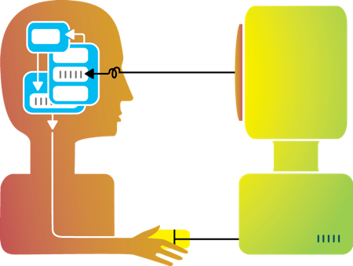

*“Of all the problems confronting science, the hardest to solve has been the production of a model of man that could do justice to all the aspects of the awareness that man has of himself.” Caleb Gattegno, The Mind Teaches the Brain*

Parenting involves trying to get your children to do things — eat, sleep, learn, be nice, etc. Of course, kids aren’t robots and are not very easy to control. In fact, trying to “control” children isn’t often the best way to get them to do what you want! Raising kids is incredibly complicated and part of the problem is that it is often unclear what a parent’s goals should be. Does it matter whether they eat vegetables? What should I do when they misbehave? What is most important to teach them?

> Parents need a better “mental model” of their children so they can best help them grow.

#### The Importance of Mental Models

In “The Design of Everyday Things,” Don Norman described how technology users need to construct mental models to help them understand how to make a technology do what it is supposed to do. He also described the many problems can occur when a user’s model doesn’t align with reality. For instance, Norman famously describes those [poorly-designed doors](https://sarvercgt512.wordpress.com/2013/09/12/cgt-512-goodbad-design-stewart-center-norman-doors/) that *you think* you need to pull, but the doors actually need to be pushed. His point is that well-designed systems should signify how they work, so that users can develop a more appropriate model.

When we use a system, we develop a mental model for how our actions enact changes to the system

Of course, many complex systems can’t be redesigned so they are easier to understand. In those cases, interfaces can help illustrate how the system works. For instance, while the boiler system of a naval ship is incredibly complicated, [a better designed interface](http://aaaipress.org/ojs/index.php/aimagazine/article/viewFile/434/370) can help users.

> **Well-designed models of complex systems can radically improve human performance.**

#### Empathic Modeling

One of the most important and complex systems that people need to model is other people. The human brain is the most complex object in the universe and yet we interact with hundreds of other people every day. Thankfully, the brain has evolved to give people the capacity for empathy, which provides us with the nearly magical ability to “read minds” — empathy lets us model other people’s intentions and even feel what they feel. Empathy is amazingly useful — and it is critical for parenting. However, empathy isn’t always enough.

#### Why parents need a “user model” of the mind

“If I am forceful about what needs to happen, my child will obey… right?”

Parenting is an exceptional challenge and empathy is definitely one of the most important tools we have for raising good kids.

But, when kids act like little children — which they are prone to do — our empathy can go out the window. All kids have bad behavior, but our “natural intuitions” about how to respond aren’t always so optimal for their development.

The fact is, all parents want their kids to grow up successfully. For that reason, all parents strive to help their kids develop the characteristics that are important for success. But, what is important for success? Parents could significantly benefit from a model of a child’s mind that indicates what characteristics are important to nurture, how parents can help, and when they should try to do so.

For instance, I want to help my son develop his…

* emotional control
* respect for adults
* frustration tolerance
* openness to new things
* ability to reflect on mistakes without taking it personally

…and the list goes on. All of these goals could be learned — and all of them would help him be successful. But, are these appropriate to teach at age 5? How do I teach these skills and not [get in the way](http://opinionator.blogs.nytimes.com/2014/04/12/parental-involvement-is-overrated/) of my kids’ development?

> “Raising kids” into successful adults is one of the most basic functions of society

“Raising kids” into successful adults is one of the most basic functions of society — yet, parents have a very different set of goals than institutional education. The educational standards taught at my child’s school might be great or terrible, for instance, but they really have very little bearing on how I, as a parent, should guide my child’s cognitive development.

#### Call to Action

I believe that a well-designed model of a child’s mental development — a model that is easy to understand, actionable and effective — could make a major difference for millions of children around the world. This is probably a long term research goal, but maybe some practical thinking could help.

---

[Why We Need a “User Model” of the Mind](https://medium.com/playpower-labs/why-we-need-a-better-user-model-of-the-brain-8f09b3632959) was originally published in [Playpower Labs](https://medium.com/playpower-labs) on Medium, where people are continuing the conversation by highlighting and responding to this story.