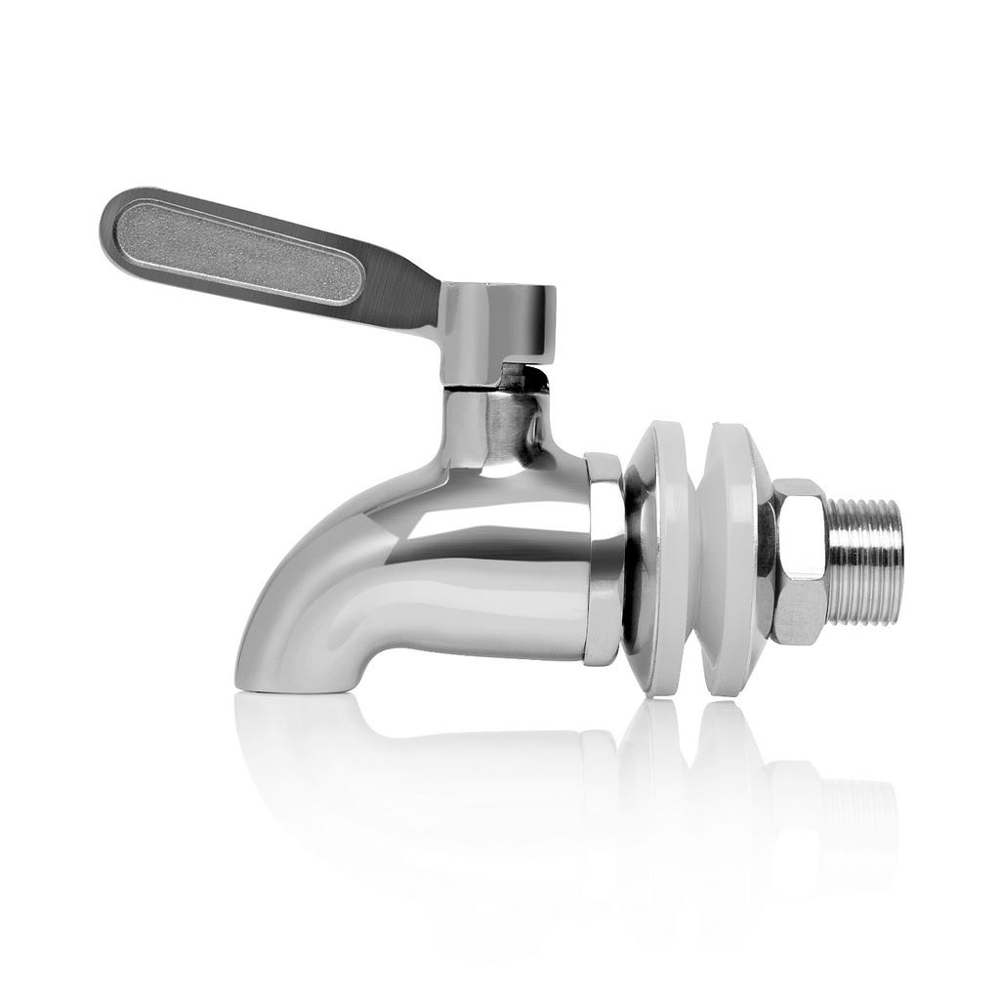
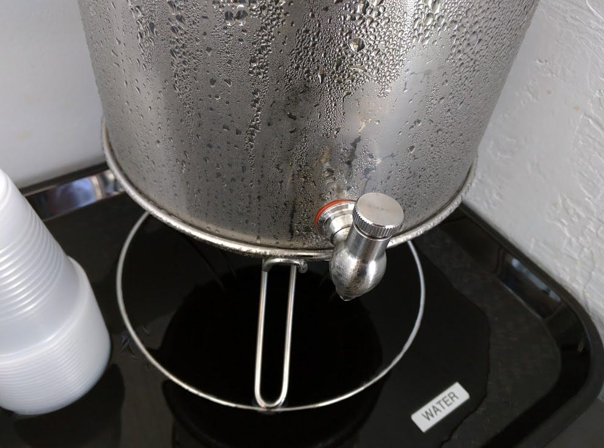
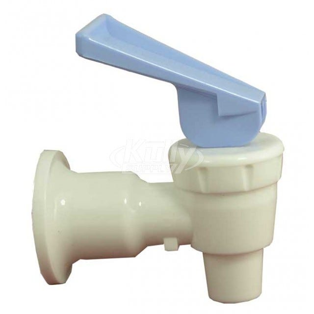

If you were trying to open [the door below,](http://notes.vvillovv.com/2009/09/norman-doors/) would you push or pull?

A particularly ambiguous “Norman Door”

Based on Don Norman’s critique of door design in “The Design of Everyday Things”, a Norman Door has come to mean a door design that causes users to develop an incorrect or ambiguous understanding of how to use the door. Norman doors don’t signify the right affordance — when users perceive the doors, they often develop a mismatched mental model of how the door works

### Norman Spigots

Can other objects be “Norman Doors,” if they cause a mismatched or ambiguous mental model of usage? For instance, consider these two spigots:

Just like a normal spigot, except that the flat yellow handle signifies an affordance of pulling up or pushing down. However, I think it is supposed to be twisted, like a normal spigot.

In contrast, by putting a flat handle in the “correct” plane, this spigot has a much less ambiguous design. One would be much less likely to pull up or push down on this handle.

This spigot is so well-designed it leaks all over the place.

Now, consider the example of this metal spigot, which I found in the HeartWork coffeeshop in San Diego. What action would you have taken to get water?

The ridges on the spigot definitely signify “grip this with your fingers.” But then, is one supposed to twist it like a faucet or pull it up like a tap?

I was trying to operate it one handed — so I weakly twisted it. A little water came out, but it didn’t feel right. So I pulled up. Water was still coming out, but it still didn’t feel right. I fiddled with it, **playing around** to try to figure out the way it worked. By the time I realized that twisting is the main mode of operation, I had spilled a little water. It was then I noticed that there was a pretty big pool of water under the spigot — from all the other customers who had had a similar encounter!

It wasn’t until my next cup of water that I realized that this spigot more like this plastic tap (pull till it “pops” open) than a faucet (more twisting = greater flow rate). In the metal spigot, you twist until it “pops” open and then you can twist no further. I must admit that the metal spigot’s ‘pop’ feeling really was delightful. However, when I had first used it, I turned it too cautiously.

So, the actual intended user model for using the metal spigot is: “firmly twist counter-clockwise until you feel a ‘pop’.” Note that it would be hard to infer this mental model just from looking at it!

So, the mental spigot is like a Norman Door — its design produced an incorrect or ambiguous mental model of how to use it. However, this is not to say that the spigot has bad design. Although the spigot requires experience, it is easily learnable just by playing around with it. That learnability is a mark of good design.

Furthermore, while this design is unfriendly to the first-time user, favoring the experienced may be appropriate in a small, hip coffeeshop. After all, there is a certain affiliative benefit from having “inside knowledge.” I literally feel proud of my water-getting-competence! This opacity to new-users is similar to how In-n-Out Burger uses “secret” menu items to make repeated customers feel a sense of competence and belonging once they learn how to order burgers “animal style.” So, because this weird Italian spigot helps contribute to Heartwork Coffee’s sense of community, one could argue that it is a really well-designed spigot!

Then again, the spigot leaks. Or in any case, it had a big pool of water underneath it, suggesting that I wasn’t the only customer that had had a “Norman Door” experience. But, this leaking primarily represents the new customers who aren’t yet familiar with how to use the spigot. In that way, the pool of water serves as an ambient information display representing new customer activity. If the employees don’t mind, why not??

There you have it: a spigot that is so well-designed that it leaks!

---

[Norman Doors](https://medium.com/playpower-labs/norman-doors-1b2fade3fe4f) was originally published in [Playpower Labs](https://medium.com/playpower-labs) on Medium, where people are continuing the conversation by highlighting and responding to this story.