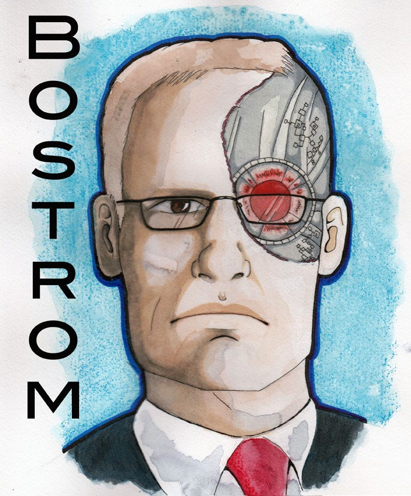
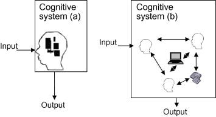
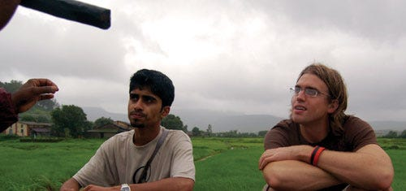
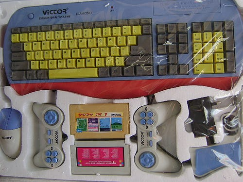

#### How my biography inspired me to attempt a truly epic design challenge

My personal mission is to design technologies to help develop human intelligence. This article will explain why I’m attempting this problem.

Dusk at Yale University

At Yale, I studied Cognitive Science. I absolutely loved it. So, when offered the chance to work in a neuroscience lab, I jumped. My project investigated how serotonin depletion affected dopamine production in genetically altered mice brains. I got really good at slicing mice brains. But I distinctly remember setting up my most important sample — when my hand slipped. The brain I was slicing crudely iced over and months of work went into the trash. My supervisor was more than kind, but the experience got me thinking — was there another way for me to study cognition that didn’t involve so many mouse brains?

#### The Future of Computer Aided Learning

I had a question I kept asking myself that year: “If we can understand how the brain works, can we understand how to make it work better?”

To help answer this question, I took a 1-on-1 course on the topic of computer-aided learning from the prominent intelligence researcher Robert Sternberg and his postdoc Anna Cianciolo (see their book, [Intelligence: a brief history](http://www.amazon.com/Intelligence-History-Anna-T-Cianciolo/dp/140510824X)). It was incredibly mind blowing. The same semester, I befriended the prominent futurist philosopher Nick Bostrom (see his book, [Superintelligence](http://www.amazon.com/Superintelligence-Dangers-Strategies-Nick-Bostrom/dp/0199678111/ref=tmm_hrd_swatch_0?_encoding=UTF8&sr=&qid=)) who encouraged me to develop a comprehensive vision of the future of education. In the document I wrote for his course, I described how intelligent systems might organize digital media and social experiences to optimize learning and motivation.

That’s Nick. ([Artists Rendition](http://www.partiallyexaminedlife.com/2015/01/06/ep108-nick-bostrom/))

As I sketched dozens of futuristic digital learning experiences, I began to think about computer-aided learning in a different way. It seemed that computers might have a huge effect on learning indirectly, if they could facilitate transformative social interactions.

To take this idea further, I ended up forming a team to build a social media network designed for discovering one’s peers at college. By providing an easy way to discover what people really cared about (after all, people don’t like to talk about their geeky interests at parties), might we facilitate better informal peer learning? We called the network Scape — it was originally an acronym for Socially Connected Academic Peer Exchange.

We started sketching in 2003, won Yale’s Business Plan Competition in 2004, and ended up launching Scape at Yale in 2005 — just months after Facebook had arrived. Despite an incredible set of features (filesharing, photos, groups, threaded conversations, etc), we most definitely did not beat Facebook. Nope! Still, it was an incredible experience. We ended up breaking even by modifying the software for Teach for America, who used it to help their teachers connect and share lessons.

After a few other cool jobs, I was given a scholarship in 2006 to join the Masters of Fine Arts program at UCSD under the Australian engineer/scientist Natalie Jeremijenko. After arriving, however, I spent most of my time at the cognitive science department.

A visual model of distributed cognition (right)

I was particularly inspired by Ed Hutchins’ theory of distributed cognition — it was unlike anything I had encountered at Yale. The theory holds that cognitive activity isn’t limited to our brains: it extends to our bodies, tools, computers and even other people. This mindset gave a new way of thinking about how to enhance human cognition with technology.

Interviewing rice farmers about their use of mobile phones

During my MFA, I received an internship with Qualcomm based in Mumbai, India. The project was called “mobile phone as first computer”: we were tasked with conducting engineering design research to understand the needs of people adopting mobile phones for the first time. I worked with a great team and we made some exciting mobile learning prototypes. That got me thinking about pure computer-aided learning again.

I ended up deciding to stay in India for a year. I taught a remote course at UCSD called “Design for Development”, which was focused on examples of how product design was creating positive and negative social change. One of the projects in this course was focused on a $10 TV-connected computer that was widely available in India. It had a keyboard and mouse, tons of 8-bit games and had a version of BASIC that helped kids make their own video games. For $10!

One of the dozens of brands of “TV-Computers”

After returning to the states, I was accepted as a visiting scholar at [MIT for the International Development Design Summit](http://www.dailytech.com/MIT+Students+Develop+12+OLPC+Competitor+Based+on+NES+Console/article12611c.htm). It was there that I worked with an incredible team to explore how to redesign the $10 computer to support scalable and effective learning outcomes. We launched the organization playpower.org to make an open-source development kit for making learning games on the platform. [The MacArthur Foundation even awarded us with a Digital Media and Learning Award to help](http://ucsdnews.ucsd.edu/archive/newsrel/general/08-09PlayPower.asp).

The point of my work with Playpower was not about a single cheap computer. Instead, this computer simply illustrated that the cost of hardware was not the problem. Instead, the problem was creating engaging, effective and accessible software for the ultra-cheap computers that the market would eventually provide.

The Carnegie Mellon School of Computer Science

With this goal of designing effective learning software, in 2009 I decided to pursue a PhD in Human-Computer Interaction from Carnegie Mellon University. I was awarded a 5-year PIER training fellowship from the national Institute for Education Science. I started making digital games that could train “number sense” and ended up winning the [National STEM Game competition from Sesame Street and the White House.](http://www.theesa.com/article/u-s-chief-technology-officer-announces-winners-first-annual-national-stem-video-game-challenge/) Our games were put on Brainpop.com and started getting thousands of players a day. My research shifted to how to use large-online experiments to measure and optimize learning efficacy.

The Playpower team, which had worked with me to develop the 8-bit learning games, started producing cross-platform math learning apps. To create a sustainable business, we joined the Techstars Accelerator at Kaplan, in New York. It was there that we decided to change our focus from making apps to making software that we could license to educational publishers. It took a year, but we successfully licensed our content to several large publishers.

The summer of 2014, I had the wonderful opportunity to work for Max Ventilla, a friend from Yale and CEO at AltSchool. It was an incredible learning experience — I’d never been surrounded by smarter, more driven people (I mean, these people could play scrabble like you wouldn’t believe). AltSchool was an opportunity to think holistically about education and realize the limitations of purely digital experiences. At the end of the summer, I returned to Carnegie Mellon and I finished my dissertation in 3 months. It was a blast.

It is awfully nice working at UC San Diego!

Then, two things happened. One, I got the opportunity to join the new UCSD Design Lab as a Design Fellow, where I could work with Don Norman, Scott Klemmer, Jim Hollan, Ed Hutchins and my best friend, Albert Lin. The second thing that happened was my company received funding from the management team at Sprinklr — to create an adaptive media system to support children’s learning.

Over the past 6 months, I’ve been trying hard to integrate these two opportunities. Jointly, it represented an opportunity to design a system that wouldn’t be possible to design in a purely business setting nor in a purely academic setting. This is one of the main reasons why I’ve settled on the idea of developing human intelligence: it is a hard problem that requires both a significant grasp of contemporary theory and a willingness to modify theory to make it practicable within an actual product design.

Stay tuned!

---

[Why I’m Designing Technologies to Develop Human Intelligence](https://medium.com/playpower-labs/why-i-m-designing-technologies-to-develop-human-intelligence-3921ab5f067f) was originally published in [Playpower Labs](https://medium.com/playpower-labs) on Medium, where people are continuing the conversation by highlighting and responding to this story.