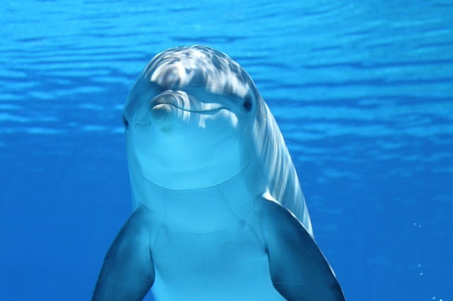
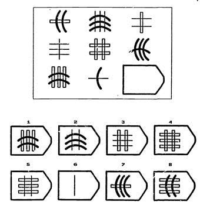
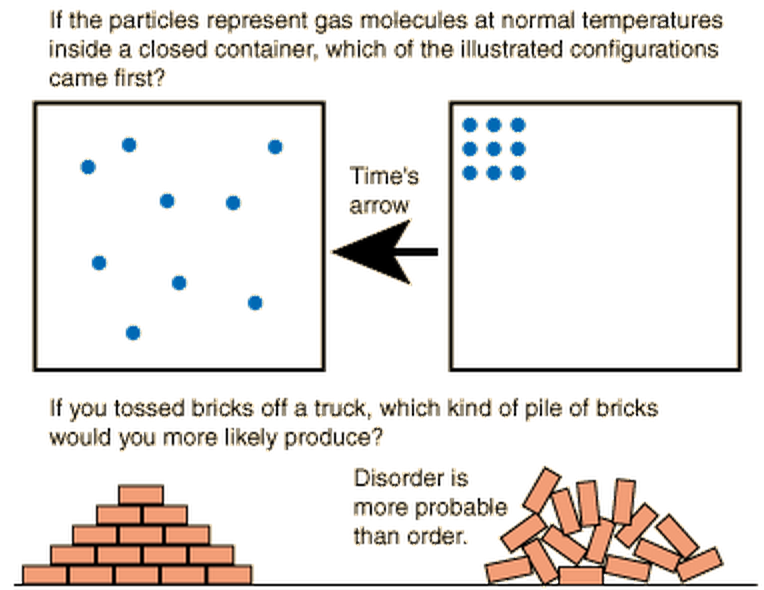
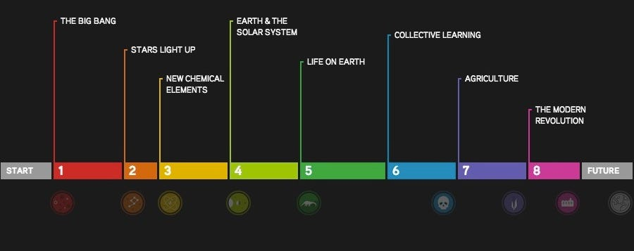
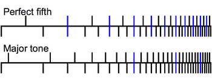
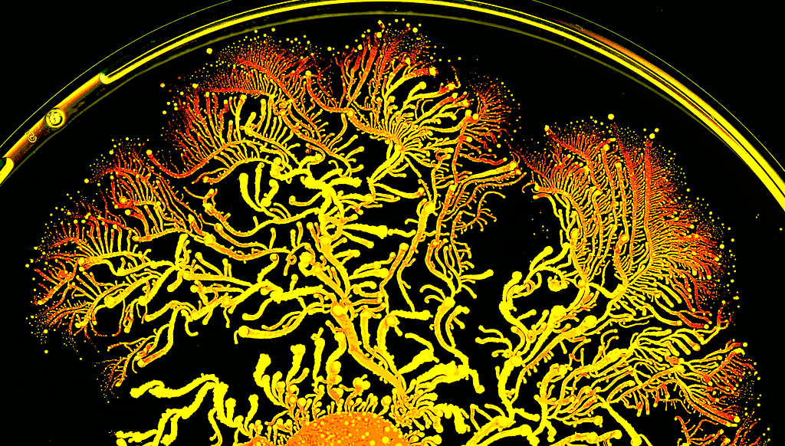
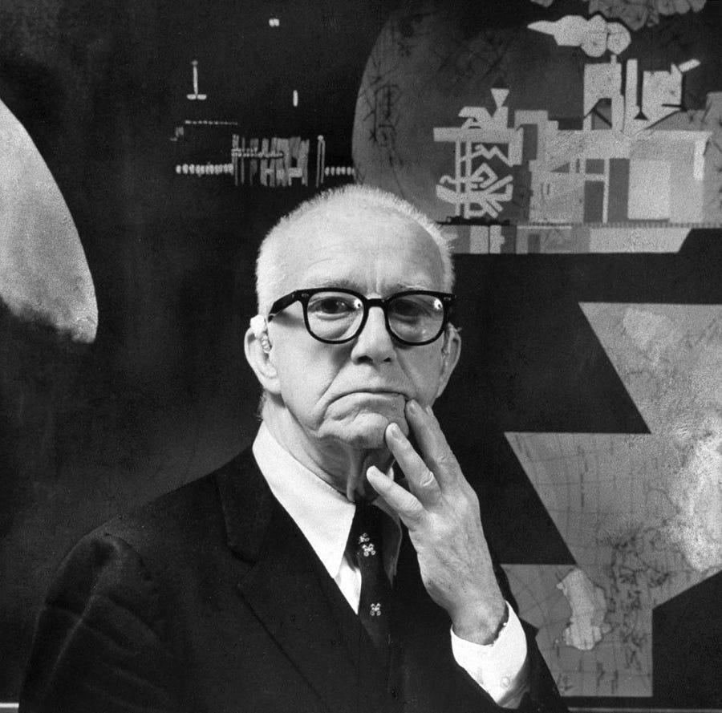
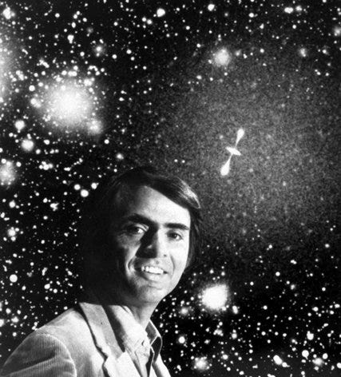

#### There is no commonly accepted definition of intelligence. Yet, a better understanding might support the design of a more successful human future.

“Artificial Intelligence” has been in the news a lot lately: self-driving cars, computer vision and automated journalism are some notable examples. Yet, amid all the excitement around the rapid emergence of machine intellience, it is worth noting that there has never been a broadly adopted definition of intelligence itself. Here, for instance, is a [scholarly paper that reviews 71 separate definitions of intelligence](http://www.vetta.org/documents/A-Collection-of-Definitions-of-Intelligence.pdf). Unsurprisingly, the authors of the review offer a 72nd definition:

> “Intelligence measures an agent’s ability to achieve goals in a wide range of environments.” (Legg and Hutter, 2006)

#### **Implications of Defining Intelligence**

Why does it matter how intelligence is defined? Well, consider the question of whether animals have intelligence. For instance, do chimps, dogs or dolphins have intelligence? Many people would say *definitely, yes*. Mice? *Sure*. Lizards? *ok*. Sea Slugs? *maybe*. Bacteria??

What are the boundaries of intelligence? If dolphins have intelligence, perhaps all living things have some degree of intelligence, as well.

So, if we were to define intelligence as the ability to successfully achieve goals in different environments, we’d need to be extra careful about how we define goals. If we’re talking about “human-like goals,” then goals definitely require language abilities. And, if the definition of intelligence requires a human-like cognition, we’d be forced to say that only humans have intelligence.

On the other hand, it’s fair to say that all living things have goals, in a certain sense — staying alive, for instance. With this more inclusive sense of goals, all living things can be described as having intelligence. Thus, we have a choice between treating intelligence as a biological property that is present in all living things or as a property that is unique to humans.

#### Intelligence and Biological Adaptation

After reviewing the 71 definitions of intelligence above, I found that about 20% referred to the capacity for adaptation. Even Alfred Binet (who developed the original IQ test), defined intelligence as “the faculty of adapting ones self to circumstances.”

Notably, adaptation is one of the central concepts in biology. However, it is primarily studied at the level of the organism. And that is where it gets confusing: for instance, the short beak of a finch is an adaptation to eating nuts — but it seems absurd to consider the beak to be intelligence. Yet, by analogy, human fingers or frontal lobes (or books, for that matter) do not contain our intelligence — but they, like the beak, allow us to act intelligently. Human intelligence would suffer, too, without fingers, books or reasoning.

#### **Classical Study of Human Intelligence**

Many psychologists who study intelligence are unlikely to accept a definition of intelligence that extends beyond human-like thought. In fact, there are many aspects of human cognition that are excluded from the traditional study of intelligence: for instance, social, emotional and character skills. Why might these important capacities be excluded from the study of human intelligence? The primary reason is that human intelligence is primarily studied through the use of IQ tests and skills like “emotional control” are rather difficult to measure.

An example problem from an IQ test, the Raven’s Progressive Matrices

What are IQ tests? There are about a half-dozen widely used IQ tests, each of which consist of a diverse set of items which were developed to measure different aspects of intelligence, such as verbal ability, spatial processing and working memory. Over the years, statisticians have noticed that individuals who perform highly on one part of the test tend to perform highly on other parts of the test. Thus, they have developed the notion of “general intelligence” or *g,* to describe a person’s general ability to perform well on IQ tests. Some claim that *g* is simply a statistical artifact, while others believe it represents a neurobiological entity which has yet to be understood.

#### Integrated Intelligence

An emphasis on IQ tests pose significant limitations to the broader study of intelligence — both for hard-to-test human skills and for instances of intelligence that exist outside of humans. Therefore, I’d like to introduce a term, “integrated intelligence,” to describe the full set of an individual’s capacities for adaptation to different environments.

This term can usefully distinguish between general intelligence (*g*) and one’s complete set of information processing characteristics that are used for environmental adaptation. For instance, [self-discipline is a better predictor of success in school and life than IQ](http://pss.sagepub.com/content/16/12/939.short), yet conservative intelligence theorists tend to exclude mindset and character from their operational definitions of intelligence. Therefore, integrated intelligence is a term that allows me refer to the full set of an individual’s adaptive mental traits.

Note the difference between integrated intelligence and general intelligence: general intelligence refers only to an individual’s *g* (their underlying performance level, as measured by IQ tests), while the term “integrated intelligence” refers to the complete set of an individual’s adaptive mental characteristics.

Why “integrated” intelligence? For instance, “total intelligence” might work as well. However, there are two, related aspects of integration that are at work. The first aspect refers how an organism integrates many separate capacities into a singular adaptive capacity of intelligence. As such, “integrated intelligence” can usefully refer to all aspects of human cognition that contribute to adaptation, not just those that are tested by IQ tests. This inclusiveness allows the term to be applied to non-human adaptive systems.

Illustration of Entropy

The second reason why I like the term “integrated intelligence” is that *integration* is the thermodynamic process shared by all intelligent things. The second law of thermodynamics, that the universe trends towards increased entropy, means that organized systems will tend towards disintegration. However, intelligence is what enables adaptive systems to oppose this trend and move towards integration. Hence, *integrated intelligence.*

#### **Entropy and Intelligence**

What is the common link between human intelligence, animal intelligence, collective intelligence and artificial intelligence? So far, I’ve asserted that it is the capacity to adapt to one’s environment in order to achieve goals. However, this just leaves the process of “adaptation” as a black box. The question becomes, what makes an adaptation effective, such that it contributes to one’s environmental success? I claim that, across all of these systems (human, machine, animal, etc), the basic thermodynamic process required for adaptation is the production of negentropy.

> “What an organism feeds upon is negative entropy.” Erwin Schrödinger, 1944

To help me make this argument, allow me highlight the emerging field of [“Big History](https://en.wikipedia.org/wiki/Big_History)” (do watch the popular [TED talk](http://www.ted.com/talks/david_christian_big_history?language=en), if you haven’t already). Big History posits that all historical narratives can be understood in the context of a *universal narrative* that started with the big bang. While it sounds fanciful to suggest that a single narrative can describe the entire history of the universe, Big History does a damn good job.

Threshold events in Big History (not to scale!)

Big History presents the entire history (and future) of the world as the story of the emergence of complexity in the face of the second law of thermodynamics. The second law of thermodynamics states that the entropy (disorder) of the entire universe, as an isolated system, will always increase over time. Thus, Big History investigates how complex systems can emerge, from the formation of the stars to the formation of life. While gravity can explain how hydrogen atoms aggregated and unified to become stars, far more complex explanations are required to understand how complex molecules aggregated and unified to form life, how single cells aggregated and unified to become multi-cellular organisms, and how complex organisms aggregated and unified to become the complex, globally interconnected human society in which we live. The “hook” of the Big History narrative is that it is amazing that this can happen in a world where entropy must increase. (I should note that living things do not actually reduce entropy in the universe — they accelerate it. But relatively speaking, life is able to reduce entropy in a local, unclosed system).

As entropy is system disintegration, the opposite can be understood as negentropy, or system integration. How does this occur? The idea is that all systems need to produce negentropy in order to survive — and intelligence can be understood as the capacity of a system to produce it. Living things use intelligence (i.e., their adaptive capacities) to reduce their local entropy. Even systems that aren’t alive need to produce negentropy: for instance, if human organizations don’t fight the forces of entropy, they inevitably dissolve.

#### **Connecting to Theories of Human Motivation**

The theory that “integration is what intelligence does” should have observable effects in the world — and should make useful predictions. One excellent corroborating example comes from the study of human motivation. Beneath the unparalleled human intelligence and complexity, what are the factors that motivate human behavior?

“Self-Determination Theory” is the most widely cited theory of human motivation. This theory codifies integration as the underlying basis for all psychological needs (autonomy, belongingness and competence). The authors, Deci and Ryan, describe integration processes as the very starting point of their theory :

> “The starting point for SDT is the postulate that humans are active, growth-oriented organisms who are naturally inclined toward integration of their psychic elements into a unified sense of self and integration of themselves into larger social structures. In other words, SDT suggests that it is part of the adaptive design of the human organism to engage interesting activities, to exercise capacities, to pursue connectedness in social groups, and to integrate intrapsychic and interpersonal experiences into a relative unity.” (Deci and Ryan, 2000)

So, the most successful theory of human motivation is that, at the core, humans seek integration. However, Deci and Ryan go further, and suggest that this process of integration is not unique to humans but that:

> “the basic tendency towards integrated functioning is perhaps the most fundamental characteristic of living things.” (Deci and Ryan, 2000)

This idea of integration and harmony as the basis of human motivation is not new. For instance, Maslow’s Theory of Human Motivation (1943) begins with the statement: “The integrated wholeness of the organism must be one of the foundation stones of motivation theory.” But we can go even further back to Plato, who made similar claims 2,500 years ago to describe the achievement of pleasure and virtue.

> “when the harmony in living creatures is disrupted, there will at the same time be a disintegration of their nature and a rise of pain…but if the reverse happens, and harmony is regained and the former nature restored, we have to say that pleasure arises. “ (Plato, Philebus)

#### Harmony and Intelligence

I’ve found the term “harmony” to be useful for communicating the process of integration. In a musical context, harmony refers to notes that are played together, such as in a chord. Some notes join together “harmoniously”, meaning they “fit well” and sound pleasant. Well-defined mathematical and psychological principles determine which notes fit well together (in consonance) or poorly (in dissonance); consonant notes achieve something known as “perceptual fusion” whereas dissonance is accompanied by a roughness and tension.

“Consonance may be explained as caused by a larger number of aligning harmonics (blue) between two notes. ([Play](https://en.wikipedia.org/wiki/File:Just_perfect_fifth_on_C.mid)) Dissonance is caused by the beating between close but non-aligned harmonics” From [Wikipedia](https://en.wikipedia.org/wiki/Consonance_and_dissonance#Physiological_basis_of_dissonance)

Although harmony and integration are essentially synonyms, it may be easier to gain a visceral, intuitive understanding of the term harmony. It is already common to use harmony n aesthetic contexts to refer to a strong integration of parts (e.g., “a harmonious composition”) or even far outside of a music context (e.g., “living in peace and harmony”). One of the most successful psychological theories of all time, the theory of “[cognitive dissonance](https://en.wikipedia.org/wiki/Cognitive_dissonance),” describes the stress and discomfort felt by individuals who maintain two contradictory beliefs. Therefore, it is appropriate and meaningful to describe intelligence as the capacity that enables organisms to achieve harmony within their environment.

#### Intelligence and Predictive Models

I run the risk of sounding mystical when asserting a notion of intelligence that can be extended to all living things — particularly when I’m using terms like “harmony” to describe the function of intelligence. To help ground this discussion, let me describe a rough operational model of how intelligence works.

One critical feature of human intelligence is the ability to create predictive models of the outside world. Indeed, our modeling abilities are so strong that we often forget that the world we experience is just a mental construction! Our entire universe is only as complex as our ability to create a model of it in our brain. Modeling the world is essential, as the external world is far too complex to reproduce in our mind in perfect fidelity — instead, we deal with the world using a series of simplified models. These models often consist of simple relationships that allow us to make useful predictions.

For example, imagine you are driving and you see a car that is driving erratically. So, you slow down and give them some extra space. You are able to take a very complex visual scenario, extract a key piece of information to support a generalization (cars that drive erratically are dangerous), and make an intelligent action (give them space). This theory is a vast simplification of the world, yet our entire universe consists of these sorts of simplified generalizations.

Now, when we consider non-human intelligence, a similar set of modeling properties are also apparent. Certainly the adaptive capacities of AI systems are based upon simplified models that seek to generalize over individual instances. And although other animals lack our linguistic capacities, they too can make simple generalizable theories based on prior experience. For example, a cat might associate the return of their owner with food and act in a manner that will ensure they are fed.

The image of P. vortex colony was created at Prof. Ben-Jacob’s lab, at Tel-Aviv University, Israel

Yet, learning is not even necessary for an organism to have a useful predictive model of the outside world. Consider the fact that bacteria have structural and chemical features that reflect the nature of their outside world: their complex chemical pathways serve as a model of the behavior of the outside world and support the organism’s adaptive responses. Is it surprising, then, that [scientists at UCSD developed a measure of bacteria social IQ](https://en.wikipedia.org/wiki/Social_IQ_score_of_bacteria)?

All intelligent systems, from micro-organisms to AI need to maintain internal structures that reflect the structures of the outside world. The degree to which internal models predictively correspond to the external world is what determines our ability to achieve harmony in the world. It is not that these internal structures must correspond with fidelity and accuracy to the outside world, but rather that our internal models must make practically useful predictions. When internal models do not predictively align with external conditions, we experience failure.

In summary, my claim is that a fundamental feature of all intelligent systems is the ability to make predictive responses based upon the use of simplified models of environment. I claim that even simple life-forms like bacteria have these predictive models, which is why it is appropriate to consider their adaptive behavior intelligent.

#### Intelligence and Good Design

> “Design is fundamentally an integrative process involving the synthesis of elements into a coherent whole. Superior design reflects the integrity of means, execution and purpose.” Buckminster Fuller Institute

Buckminster Fuller

As a designer, I’ve been reflecting a lot on the role of integrity and integration in design. For instance, a formal “theory of good design” could consist of the following hypothesis: “given that design serves to transform present states into more preferred states, preferred states are always those that generate greater internal or external integrity.” But, an easier way to describe and measure this relationship would be to say “good design helps users achieve their goals.”

How does this connect design to intelligence? Consider the definition of intelligence presented above (“an agent’s ability to achieve goals in a wide range of environments”). If design is all about making artifacts that enhance the ability of users to achieve goals, then good design should enhance user intelligence! That artifacts can increase human intelligence would be denied by traditional views on intelligence, yet seems inevitable when taking a [distributed cognition perspective](https://en.wikipedia.org/wiki/Socially_distributed_cognition).

#### Collective Intelligence

As a last note, it is important to highlight the role of collective intelligence in human intelligence. Collective Intelligence describes how groups of individuals can achieve greater levels of intelligence than any particular individual. Individual human intelligence is contagious, spreading through social networks. Any individual person’s intelligence is a function of their engagement with other people — each person gains access to the accumulated cultural intelligence of the millions of people who have ever existed. In the Big History TED Talk, David Christian describes how animals developed the ability to learn, but humans developed the ability to pass on and accumulate the learnings of a lifetime. Our intelligence is now shared across the entire globe through digital media.

MIT’s [center for collective intelligence](http://cci.mit.edu/) presents their core research question as

> How can people and computers be connected so that — collectively — they act more intelligently than any person, group, or computer has ever done before?

This statement highlights the hope that the integration of computers, humans and groups can enable a far more intelligent and adaptive human society.

#### **Conclusion**

To articulate a useful theory of intelligence that can span from machines to micro-organisms, I’ve discussed a diverse set of topics: biological adaptation, Big History, thermodynamics, human motivational theory, musical harmony, design and collective intelligence. Rather than trying to add a 73rd definition of intelligence, I’ve introduced the term “integrated intelligence” to describe the full set of adaptive capacities that enable people and other systems to succeed in their environments. Firstly, this term is useful for describing human intelligence in a manner that extends beyond IQ tests; secondly, it usefully refers to the capacity that is shared between animal, machine and collective intelligence.

One of my hopes for investigating the nature of intelligence is to gain insight on whether it can be increased. If intelligence is the capacity for adaptation to a changing world, then greater intelligence should help humans adapt to our highly uncertain future. One approach to increasing intelligence is through well-designed useful artifacts. It also seems possible to enhance intelligence through interventions that support healthy individual cognitive development. In designing such interventions, we are not limited to what might be tested on an IQ test. Instead, we can think broadly at what might enable an individual to better adapt to their environments to achieve their goals in life. Thus, further clarity on the underlying nature of intelligence may support the larger design challenge of producing interventions that can increase human intelligence at scale.

Gratuitous picture of Carl Sagan and the cosmos

#### End Note

In this discussion, I’ve barely touched on concepts like working memory, reasoning and reflective thought. These systems are critical for human information processing — but they are still just components of human intelligence. They can be referred to more directly by the term “intellect” or “intellectual abilities.” I will directly address these concepts in future posts.

---

[What is Intelligence?](https://medium.com/playpower-labs/what-is-intelligence-92205f5e96eb) was originally published in [Playpower Labs](https://medium.com/playpower-labs) on Medium, where people are continuing the conversation by highlighting and responding to this story.