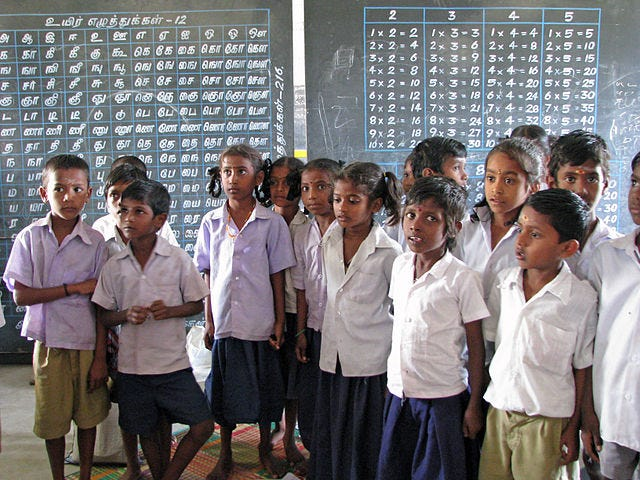

#### *What is intelligence — and can we improve it?*

*Intelligence is an important human characteristic that* can *be improved. Designing better ways to help people build intelligence could make a major difference in their lives.*

A new UC Berkeley Study: [“Stereotypes persist that class and privilege determine intellect and success”](http://news.berkeley.edu/2015/03/31/caste-stereotypes/) (photo: [McKay Savage](http://www.flickr.com/photos/56796376@N00))

The notion that intelligence is fixed from birth is a [terrible and yet pervasive myth](http://news.berkeley.edu/2015/03/31/caste-stereotypes/).

[Psychologists](http://onlinelibrary.wiley.com/doi/10.1111/j.1467-8624.2007.00995.x/abstract?userIsAuthenticated=false&deniedAccessCustomisedMessage=) have shown that the mere belief that intelligence is fixed from birth reduces a person’s capacity to learn. In contrast, those who believe that intelligence can be improved actually learn more effectively. **Millions of people would benefit just from having a new way of looking at intelligence.**

> Smart isn’t something you are. It is something you get.

### What is Intelligence?

Many people have the belief that IQ is the same as intelligence. They are wrong. IQ is a measure of what is known as *general intelligence —*it is important, no doubt, but human intelligence is much, much broader than what is measured on this test.

The scientific consensus on intelligence (to the extent that scientists agree on anything) is that it is a person’s capacity to solve problems, achieve goals, and, generally, *to successfully adapt to one’s environment*. For instance, Alfred Binet (who developed the original IQ test), defined intelligence as “the faculty of adapting ones self to circumstances.” Scientists developing artificial intelligence use similar definitions. No one, however, believes that intelligence is *defined* by a single number, such as IQ.

If we think about intelligence as “the mental qualities that support success in life”, then it becomes quite clear how to improve it: we should teach people the things that will help them achieve success! Improving intelligence for the sake of improving IQ scores would be trivial. However, if the point of improving intelligence is to help people live happier and more successful lives—well, that’s a meaningful cause.

For more on the nature of success, [read “What is Success, Really?](https://medium.com/learnworld-blog/what-is-success-really-26b7c5918aad)”

### The 4Cs of Success Intelligence

What are the mental characteristics that support success in life? Can they be taught? After reviewing hundreds of academic papers and books, I’ve found it useful to divide up intelligence-building skills across four major areas, which I can “the 4 Cs”: Curiosity, Character, Creativity and Cognitive Skills.

### Curiosity

Curiosity is the natural drive to learn and it is an essential characteristic of human intelligence. The world’s most intelligent people are described as intensely curious — always learning, always questioning. When curiosity is applied to any subject, it makes learning faster and deeper. Learning is accelerated because one actually cares to understand! Therefore, we can help increase a child’s intelligence by cultivating their curiosity for many things. But we need to be careful — you can’t *force* curiosity. But we can nurture curiosity by providing a child freedom, encouragement and access to interesting experiences. Let a child’s interests bloom!

### Character

A great deal of human success comes from what Nobel Prize-winning economist James Heckman calls “Character Skills.” These skills are diverse, but they include emotional regulation, perseverance, honesty, optimism, tolerance and the ability to work well with other people. Studies have shown that character skills are crucial for success in school, on the job and in friendships. Character skills include mindsets towards failure — having a strong character allows one to approach challenges in order to learn, rather than avoiding challenges for fear of failure. This one disposition (avoidance of challenge for fear of failure) is probably the biggest barrier to a child’s learning. But if parents work hard to help instill the right values (i.e., value learning, not just successful performance), their children will surely benefit.

### Creativity

Creative problem solving requires both analytical skills and a broad “associative horizon.” Great problem solvers consider many different approaches — even ones that may seem absurd. The ability to bring one’s imagination into reality is a powerful skill that can be improved with practice, training and confidence in one’s self. Additionally, so-called “Design Thinking” methods can help people become more effective problem solvers and produce better solutions over a range of activities.

### Cognitive Skills

Reasoning skills, attentional control, cognitive flexibility, reaction speed and memory are components of most human activities —and even moderate improvements in these skills have the potential to yield big performance gains in many areas. These traits are measured by IQ tests.

Can these skills be improved? A recent study produced large increases in IQ through an interesting approach: having students learn to play games. Students were assigned to either play games involving reasoning and decision making (i.e., chess) or games involving speed (i.e., shoot-em-up style video games). After several weeks (3 hours a week), the researchers found that players who were assigned to “speed” games improved on the speed portion of their IQ tests. However, the players assigned to “reasoning” games had large and general improvements in their IQ — increases of as much as 20 IQ points. No single game helped produce these improvements. Instead, researchers believe that it was the diversity of challenges — and perhaps, the goal-directed social context of the playing.

The 4Cs listed above have something in common: they all have the ability to help people learn faster, generally perform better and improve a person’s potential for success. Any learnable capability that supports these goals can be thought of as an “intelligence-building” skill.

### Designing Systems for Building Intelligence

An enormous amount of scientific effort is being applied to the improvement of artificial intelligence. As a result, there have been incredible gains in artificial intelligence. But consider: what might be the outcome, if more effort were applied towards the improvement of human intelligence?

Our team is inspired by the scientific and design challenge of developing systems that can measurably improve human intelligence, globally. We’ve taken on an ambitious but achievable goal: **developing** **a program to help parents nurture their children’s intelligence.**

Our approach seeks to leverage the motivation that parents have for helping their children achieve happy, successful lives. We want to design technology that collaborates with parents to help them create non-digital environments that cultivate curiosity, creativity, character and cognitive skills. In addition, we are designing an adaptive media system to give children personalized intelligence-building activities on a daily basis. We are combining so-called “brain games” with videos, design tools and other interactive activities that can engage kids in developing their own intelligence skills.

We call our efforts “LearnWorld.” Stay tuned!

---

[Can Intelligence Be Built?](https://medium.com/playpower-labs/can-intelligence-be-built-f8bcd068236f) was originally published in [Playpower Labs](https://medium.com/playpower-labs) on Medium, where people are continuing the conversation by highlighting and responding to this story.