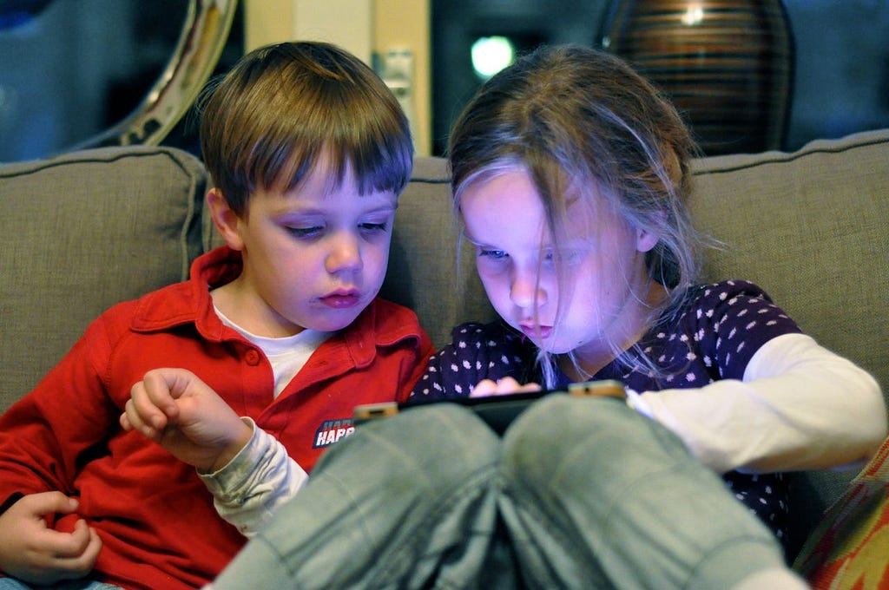

#### *How might AI help nurture human intelligence?*

How might we design an intelligence-building system for kids? First, we need to consider some real world constraints.

The iPad Babysitter

First of all, many kids are attracted to digital technology for the entertainment value — and the entertainment that is currently available to them is incredibly compelling.

Second, while parents care about helping their children develop, they are stressed, busy and desperate for time — which is why a parent’s killer app for the iPad is the cheap babysitting it provides.

> What we wanted was a sort of netflix for the entire internet — adaptively recommending games, videos, music and reading — all based upon a balanced model of what a child likes and what their parents think is “good for them”.

An internet-connected tablet is, arguably, a portal to all of accumulated human knowledge. Woah! So, how can we design this portal so that kids benefit more from their time spent in front of the screen?

With any aspect of parenting, there is always a balance between what parents want and what kids want. To make a tablet experience that was truly beneficial for the child, we’d need to balance a parent’s values, a child’s values and, potentially, some universal human values. The challenge then became creating a digital learning system that could adapt to both a child’s interests and their parent’s goals. And then, perhaps, we could make a truly intelligent internet that aims to maximize a child’s well-being, now and in the future. ([We discuss the nature of well-being in a separate article](https://medium.com/learnworld-blog/what-is-success-really-26b7c5918aad)).

To say it again: the design challenge of making an adaptive media system for kids is balancing the desires of kids (the primary user) with the desires of parents (the secondary user) . What we wanted was a sort of netflix for the entire internet — adaptively recommending games, videos, music and reading — all based upon a balanced model of what a child likes and what their parents think is “good for them”. It could nudge kids to access better content, but it couldn’t force them to engage with content that parents thought was “good for them”.

What if millions of parents participated in the curation of digital content for their kids? This could be the basis of an AI that would learn how parents decide what is best for kids at particular ages and stages of development.

#### Could Our Product Design Produce Beneficial AI?

I’ve been thinking more and more about [the challenge of creating beneficial artificial intelligence](https://intelligence.org/). Wouldn’t it be wonderful to create artificial intelligence that is purely focused on supporting children’s well-being? After all, if AI is coming, this is a much better outcome than, say, killer robots :)

> Consider: How might we develop artificial intelligence to develop human intelligence?

Below is a rough sketch for how human intelligence could *precipitate* into an effective artificially intelligence system.

1. Build a community of parents and teachers (real human intelligence)
2. Make it easy for parents and teachers to select the content that they believe is best for particular kids.
3. Measure what content the parents/teachers select. Measure what kids actually choose and the duration of their engagement
4. Gather additional information from parents and kids to support classification (e.g., age, gender, survey questions)
5. Use AI (collaborative filtering & reinforcement learning) to recommend content to similar kids and parents

The main difference between this approach and what Netflix/Youtube already does? This approach would have the ability to integrate a model of what parents want and what kids like. It could even bias the results towards some expert model of what is “good” (experts in human development could rate the “intelligence-building potential” of a subset of content). It could then be tuned, so that the system recommends content appropriate for the kid *at that present moment.*

However, one big practical problem with this approach is the fact that very few parents are up for the challenge of curating digital content for their kids. In fact, we designed an easy system that let parents choose content for their kids — so that it could be easily placed into the child’s media stream — yet, most parents admitted that it was too hard to make the choices and they just wanted their kid to chose. While this is somewhat discouraging, it is important to remember that even if we are only able to engage 2% of parents to curate content for their kids, we could still produce major benefits for the 98% of parents who don’t have the time.

I feel strongly about the potential benefits of developing robust AI that is concerned with supporting a child’s well-being. For me, this is one way to ensure that, as AI accelerates, it continues to care about human development.

#### The Current Plan

So, back to the problem of how to design systems to nurture a child’s intelligence. Instead of engaging parents in content curation, we’ve decided to focus on putting together our own, curated digital content. We’ve designed our app from the ground up to be able to measure what kids like and support continuous improvement. Our LearnWorld platform has been seeded the system with content that we believe has the potential to improve our key intelligence areas (curiosity, character, creativity and cognitive skills).

Yet, there still seems to be enormous potential in what Don Norman calls “Human Technology Teamwork.” How might technology collaborate with parents to support the heavy lifting of nurturing their child’s cognitive development? Our primary approach comes through a system designed to help parents improve their “parenting intelligence”, so they can feel more empowered to face the challenge of raising kids. How to improve “parenting intelligence?” Our approach is to synthesize decades of research on parenting techniques and child development — and then to send it out through a personalized, interactive email newsletter.

*Wait. Should we be worried that our main approach to improving intelligence is sending more emails? Nah.*

#### Conclusion

So, in conclusion, our product design goals are to do the following:

1. Design an engaging and effective app that helps kids discover “good” digital content that satisfies their curiosity and need for competence.
2. Create continuous improvement systems around our measures of success: engagement and efficacy. Our measure of engagement is the percent of kids that habitually return to the app. Our measure of efficacy is the effect size of time-spent in the app on measures like Raven’s Matrices and other psychometric instruments, as well as self-reports from parents.
3. Design a valued and effective parent service that allows us to deliver personalized parenting tips and activities to help parents achieve their goals. Our measure of whether parents value the service is the percent of parents that share the service with their friends. Our measures of efficacy is the same as #1.

So, there it is: I’ve previously described why I’m pursing the goal of developing human intelligence and now I’ve described how we plan to do it. Stay tuned!

— — — — — — — —

**Addendum:** [Useful, well-referenced article](https://intelligence.org/2013/05/15/when-will-ai-be-created/) on when AI will be created.

---

[How to Design Systems to Nurture a Child’s Intelligence](https://medium.com/playpower-labs/designing-systems-to-nurture-a-child-s-intelligence-985eaea69294) was originally published in [Playpower Labs](https://medium.com/playpower-labs) on Medium, where people are continuing the conversation by highlighting and responding to this story.