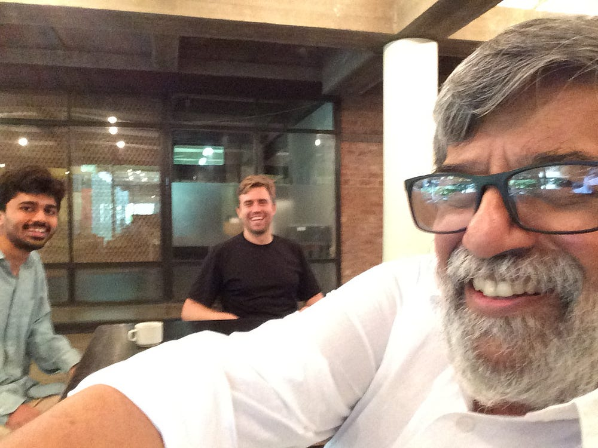

Few have done more to advance Design Thinking in India than MP Ranjan. As a faculty at the National Institute of Design (NID), he has influenced thousands of students over 45 years of teaching.

I interviewed him two days ago and, very sadly, found out that he passed away from a heart attack earlier today.

I feel extremely grateful to have spent so many hours with him. I’ve quickly transcribed some of our interview; I hope you enjoy it:

**What would you say is the difference between engineering and design?**

> Engineering, in my view, represents the technical competence of both the product and the offering. In design, the intention is not only to make the product better, but in some cases, to replace the product all together. For, the offering may not be a technical solution, it may be a social solution. If the solutions lie outside the engineering realm, engineers will never attempt it. That is what design is supposed to do. To be able to assess what needs to be brought to bear on the problem and to realize it.

> The early stages of how you set the goals becomes very critical. Once the goal is set, we know how to get hammer and tongs and try to resolve it. Everyone is very good at managing projects. But if the goal itself is set wrong? One goal is to build a bullet train from Bombay to Ahmedabad. Another is to say that we need good mobility between these cities, or for the population. So the problem can be defined in a whole lot of alternate ways. And in alternate definitions, the answer may not involve a train at all.

> So, who does this early stage reckoning of what needs to be done? That, I believe is the domain of design. It is still young in our country. And in many other places, not just our country.

**Would you say that design is a collection of independent fields or an integrated field of study?**

> Design, in my view, is a set of related abilities and a set of related attitudes. Both these things need to be developed… One attitude is when scientists ask for rigor. On the other hand, when you want to explore, you want to play. That is also an attitude. Because at an early stage, when you don’t know where to go, I think play is very good. Now, play seems like a very frivolous way of addressing a very serious problem. But from my experience, many serious problems need careful ways of finding answers. Otherwise, we can remain serious but not take it anywhere because we are still looking within the limited frames we are familiar with. So when you want to change your frame of reference, that is a big challenge today. And, I’m not sure which discipline today is able to give this alternate framing other than design. Or, what you call integrated design.

There is a lot more to share from this interview, but I hope that this gives some insights into the thinking of Mr. Ranjan. Thank you to Don Norman, who recommended that I meet him on my trip to India.

According to Mr. Ranjan, there are about 10,000 designers in India. The world needs so many more! He was teaching a course on Design Thinking. [The course syllabus](http://www.academia.edu/13596219/University_wide_course_on_Design_Thinking) is incredibly comprehensive and I’m sure would be useful to anyone teaching a design thinking course.

---

[Design Thinking in India: Remembering MP Ranjan](https://medium.com/ux-for-india/design-thinking-in-india-remembering-mp-ranjan-9a0348f251ad) was originally published in [UX in India](https://medium.com/ux-for-india) on Medium, where people are continuing the conversation by highlighting and responding to this story.