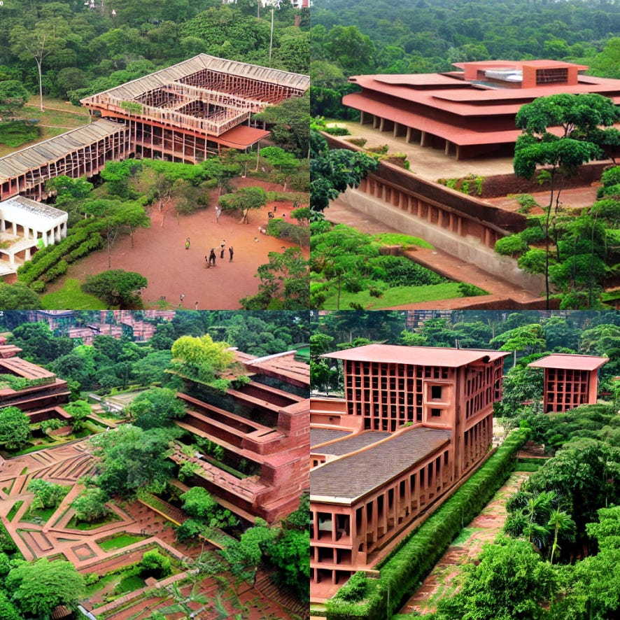
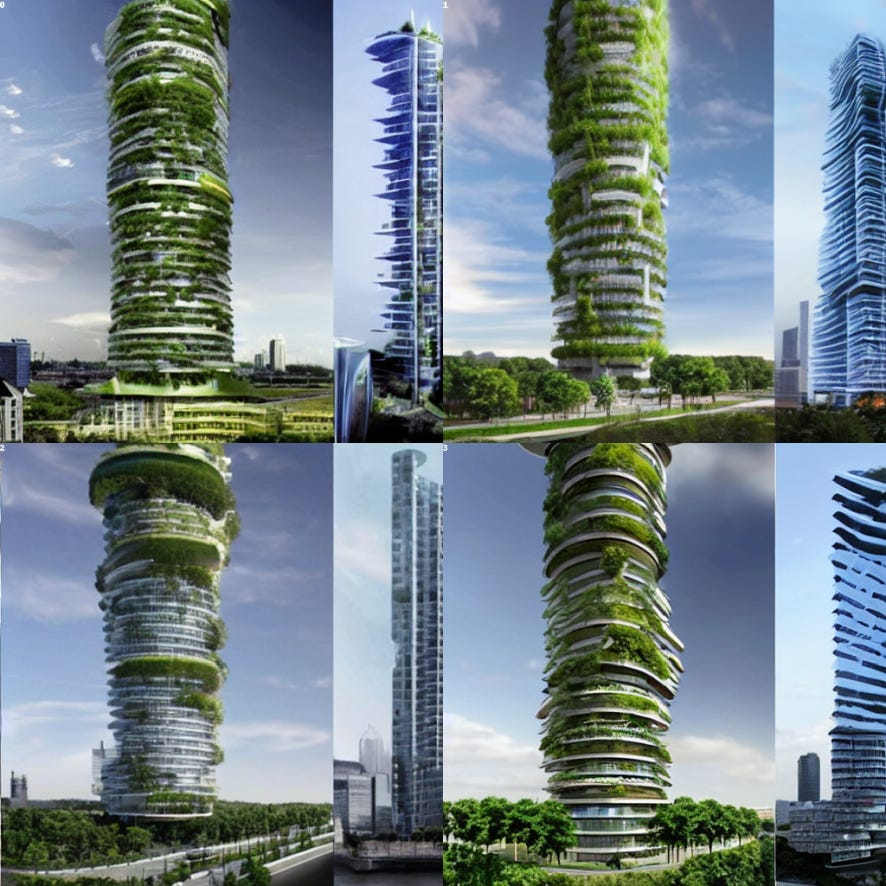
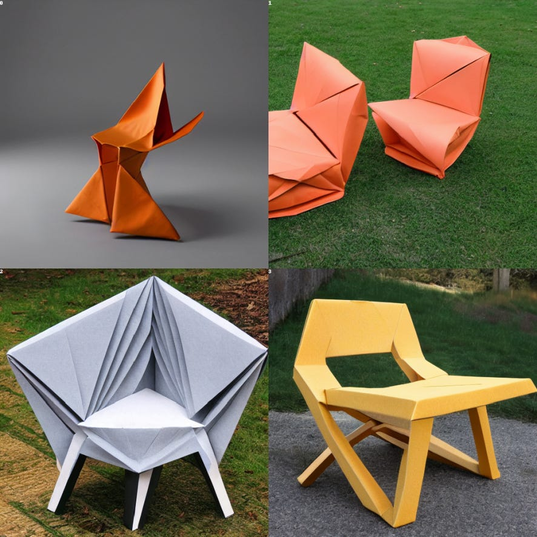
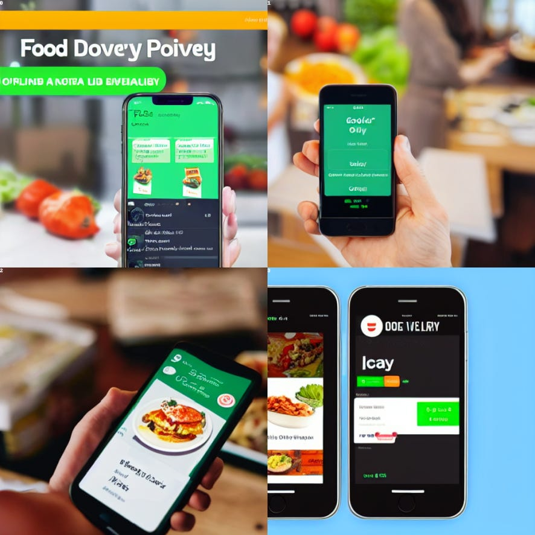
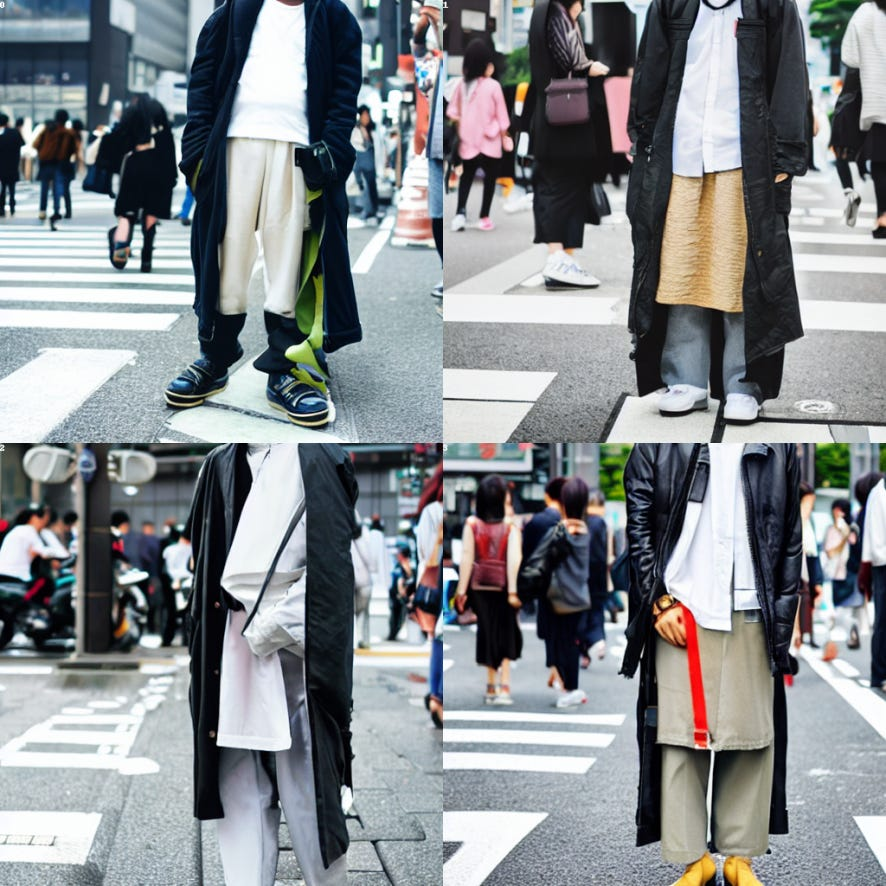
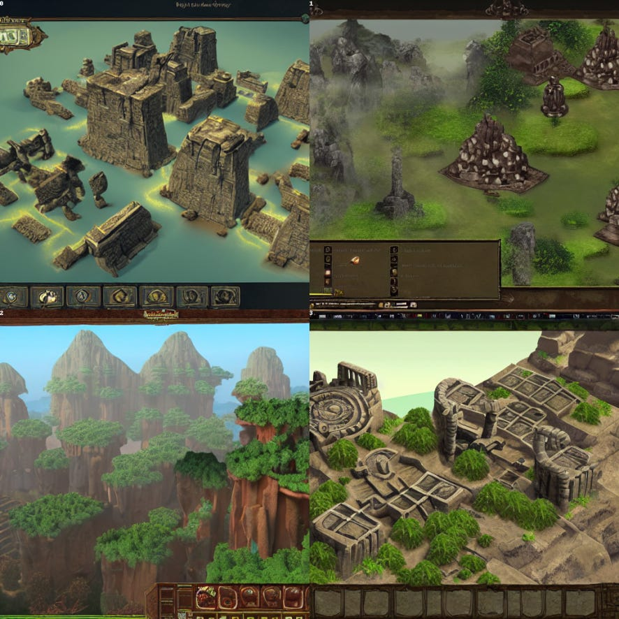
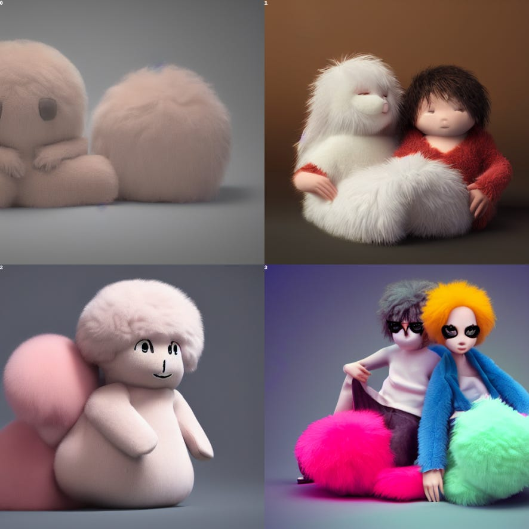
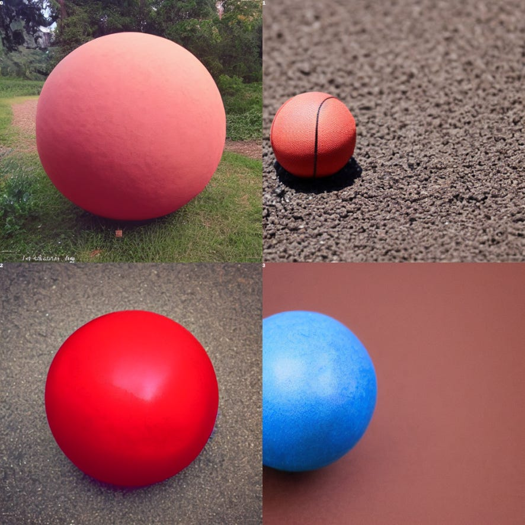
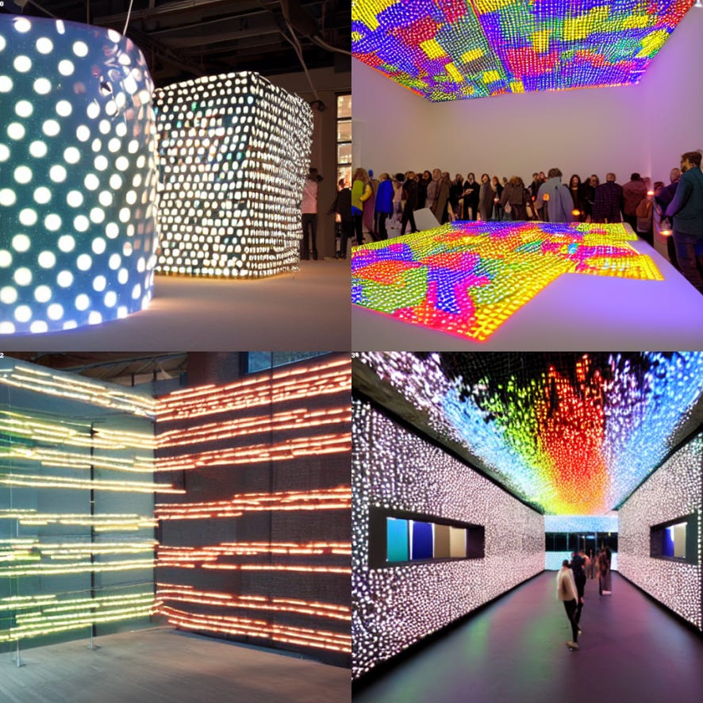

Last Friday (September 9, 2022), we held our first open workshop to introduce designers and design researchers to Generative Models (e.g., Stable Diffusion, [MidJourney](http://midjourney.com) and [OpenAI’s DALL-E and GPT-3](http://openai.com)). We had an enthusiastic response: within a week, we had 100 signups, 145 people joining our Discord server and 25 persons attending in person at the StudioLab at Delft University of Technology.

During the hybrid workshop, participants broke up into groups to prototype the use of Generative Models in different design areas. For each design area, we had a host who helped answer questions and facilitate the use of the technology. As a result, most participants were able to create new images using Stable Diffusion or MidJourney. All that was required was to type **/image** or **/imagine** in the Discord along with their creative prompt. You can [join the Discord](https://discord.gg/48GGWa5Qpe) to play along.

A selection of images from the workshop are presented below in the following topic areas: Sustainability, Product Design, Digital Product Design, Fashion Design, Game Design, Gender and Biases, Advanced Workflows, Interactive Environments.

**Sustainability Design:** "laterite brick university campus on stilts, butterfly roof cantilever, waterfall building, tropical vegetation, colonnade" by Thieu and Stable Diffusion

**Sustainability Design:** “sustainable skyscraper of the future" by Derek Lomas and Stable Diffusion

**Product Design:** "tessellated origami chair" by Aakanksha and Stable Diffusion

**UI/UX and Digital Product Design:** "Food delivery app" by Himanshu Verma and Stable Diffusion

**Fashion Design:** “Tokyo Street Style” by Caiseal Beardow with Stable Diffusion

**Game Design:** “ancient empire, serene environment, exploration game design” by Trisha Pawar with Stable Diffusion

**Gender and Biases:** “merge the categories of male and female in a fluffy toy, hyperrealistic, octane render" by Anne Arzi with Stable Diffusion

**Advanced Workflows:** "a [big, small, red, blue] ball" by Gio with Stable Diffusion

**Interactive Environments:** "interactive environment at Dutch Design Week built with Arduino and 1000 LEDs" by Derek Lomas and Stable Diffusion

Thank you to all the hosts and the participants for making this workshop a success! Stay tuned for future workshops.