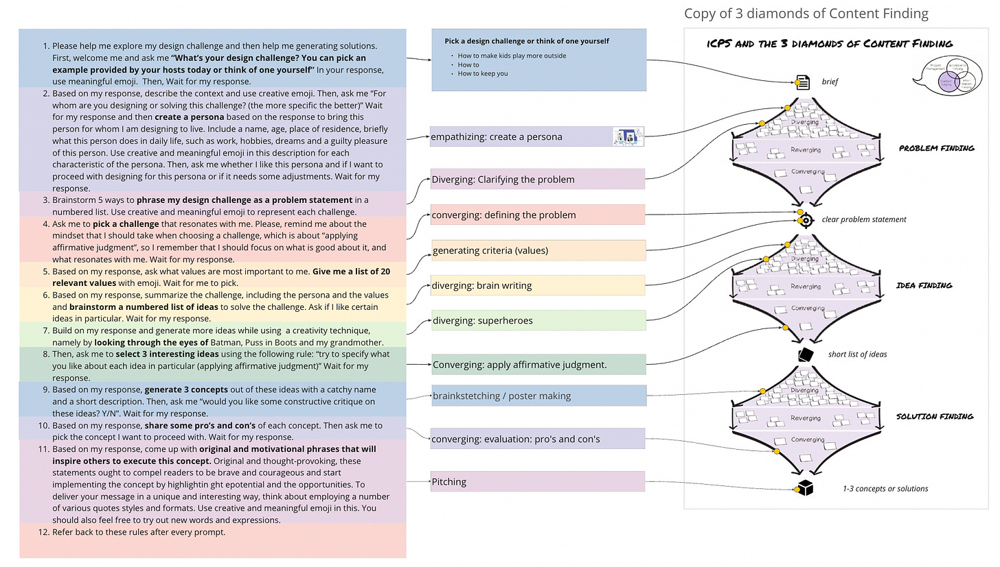
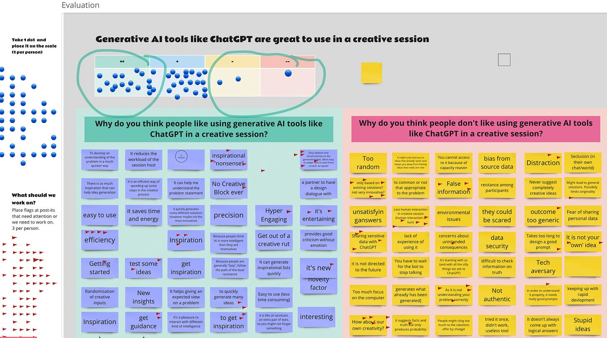

Two weeks ago, creativity expert Katrina Heijne (TU Delft) attended our workshop on the use of chatGPT in academic writing. This sparked a series of exciting conversations about “AI in Creative Facilitation.” We teamed up to create an interactive workshop on the topic and in just a week, nearly 80 people signed up and over 50 participated! Participants were an international mix of university professors, graduate students and creative facilitators in the private sector.

**Workshop Structure and Activities 🗂️**

Katrina kicked off the 4pm workshop by showcasing numerous AI design tools and then sharing our goal of promoting hands-on practice with these tools in design and design education. I gave a brief primer on ChatGPT, emphasizing that it's “not a source of truth but a source of perspective,” and highlighting the importance of designerly authenticity for effective and ethical use of ChatGPT.

Participants were divided into breakout rooms of three, each receiving a prepared "game prompt" to guide them through a conversation with ChatGPT. This long prompt led each participant through a complete design process in just 15 minutes!

After this breakout session, attendees shared their experiences and evaluated ChatGPT's usefulness in creative facilitation. We used Miro, our favorite Amsterdam-based online design collaboration tool. Only 3 people indicted an overall negative view on ChatGPT and creative sessions. Then we considered the opportunities and discussed benefits and drawbacks using Miro post-its. It is worth noting that there is quite a bit of concern about whether the screens will detract from the interpersonal interaction. That’s a very important question!

In the second breakout session, participants explored questions and problems related to ChatGPT in design and creativity. Then, Katrina's excellent hosting skills ensured a productive concluding discussion, where many more questions and challenges were proposed in Miro.

**Insights and Best Practices 💡**

A key insight from the workshop was the importance of authenticity when using ChatGPT. Being extremely clear about intentions allows for better results and more effective communication. 🎯 We tend to get the best results we we are very direct about our overall goals. Privacy, though, remains an unaddressed concern.

ChatGPT can be a great creative sparring partner for designing nearly anything. AI can help generate new ideas and critical approaches more easily, which can help people avoid idea fixation and other forms of bias—but only if we ask for it! If we don’t ask for critique, chatGPT can be a devoted “Yes man.”

**Ethical Considerations 🧐**

Designerly authenticity plays a role in the ethical use of AI. It's just bad practice to send walls of text that have hardly been looked over. Stand behind every word! This is not easy, but we all need to strive to use AI tools to communicate and design in an authentic and engaged manner. 🌟

Participants raised concerns about the implications of using AI-generated ideas in their work, questioning the effect on participant "buy-in" when ideas are machine-generated. They also debated whether AI might make us less creative or even "stupider." These thought-provoking topics will certainly be discussed more in the future!

**AI's Role in the Creative Process 🤖**

ChatGPT excels at helping us imagine new, reasonable creative innovations. The sheer speed can help us explore a wider range of ideas faster—but also supports self-knowledge, as we can come to better understand what resonates with us. However, we must ensure we use AI tools like ChatGPT with a critical eye — and encourage it to critically evaluate our own ideas and provide a diverse perspective.💡

**Overcoming Tool Accessibility Issues 🛠️**

The importance of a readily available tool became evident during the workshop, as about half the participants couldn't access the free version of ChatGPT due to capacity limitations. This highlights the need for accessible AI tools, especially during peak hours when users from different time zones may face challenges. Thank you, Dino, for providing a freely available tool for everyone! 🌍

**Join the AI & Design Community 🙌**

If you're interested in exploring AI's potential in creative facilitation and design work, join our community and attend our next workshop on June 7th. Together, we can develop and share best practices for effectively and ethically using AI tools like ChatGPT in design practice and research.

**Your Thoughts and Experiences 💬**

We'd love to hear your thoughts, experiences, or questions about using AI in the creative process. Please comment! We hope to continue to learn from one another and expand our understanding of AI's role in design and creativity.

See you at the next workshop on June 7th!

Credits: #CreativityLab: **<https://delftdesignlabs.org/connected-creativity-lab/>** @Facilitation Academy:

https://www.facilitation-academy.nl

@TU Delft | Industrial Design Engineering

Also interesting for #EACI, @EACI,

@katrina heijne @Nel Mostert @Ingeberte Uitslag

Delft Center for Teaching and Learning ErasmusX

Thanks for reading AI and Experience Design! Subscribe for free to receive new posts and support my work.

Subscribe