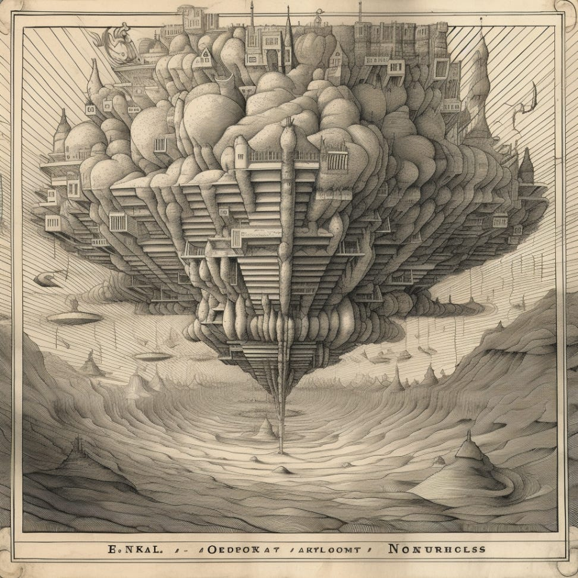
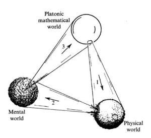
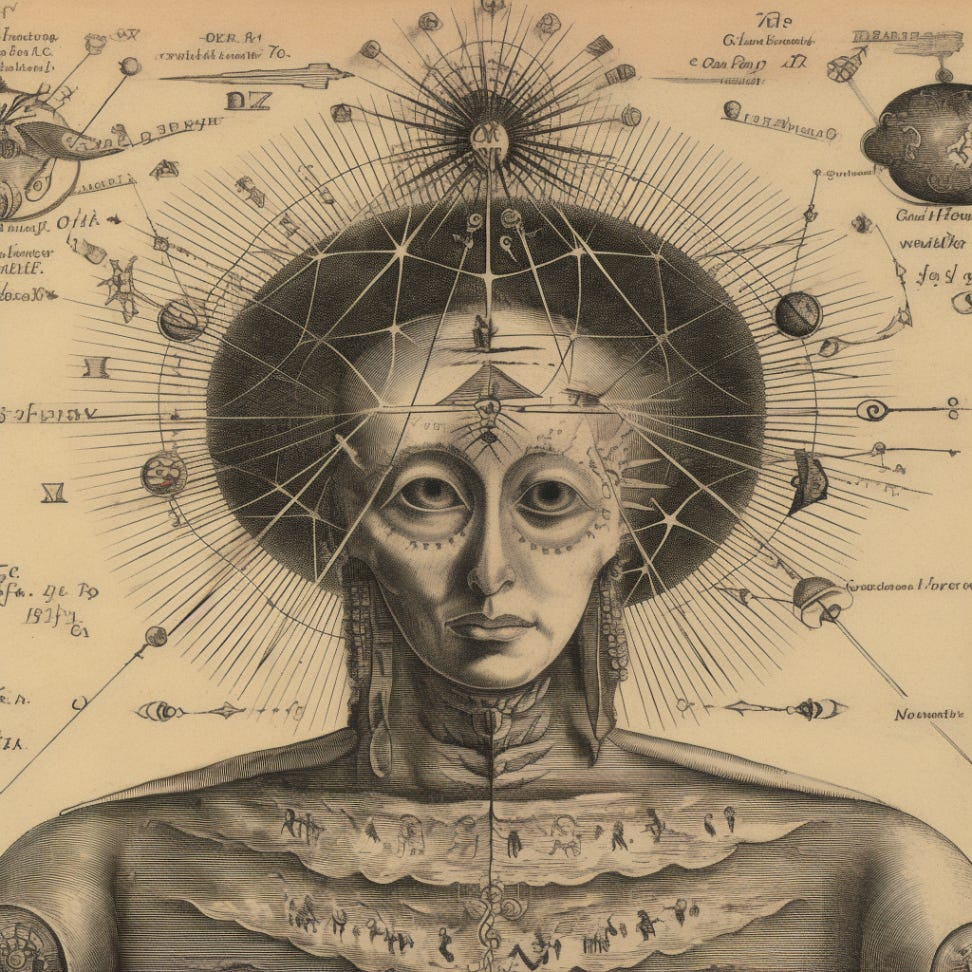
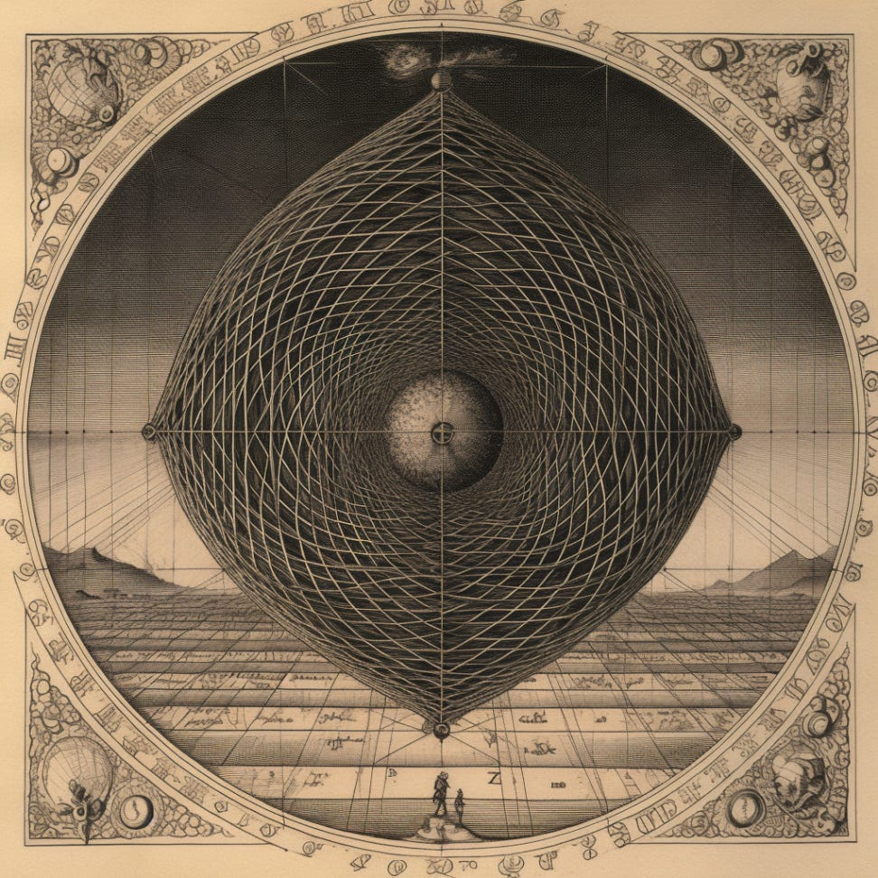

*Without consciousness, could AI systems ever “understand?” This article considers the possibility that AI systems might be able to access the Platonic “world of forms.” If so, there would be a philosophical basis for AI understanding—even without AI consciousness.*

MidJourney: “convolutional neural network layers max pooling hidden layers accessing different layers of the immaterial and transcendental realm of noetic ideas, illustrated by Athanasius Kircher”

For Pythagoras, Plato and many classical philosophers, mathematics was proof of a timeless and eternal world of ideas. Far from being outdated, the Pythagorean notion that “All is Number” is astonishingly modern. In his book “Road to Reality,” Nobel Prize Winning Physicist [Roger Penrose](https://en.wikipedia.org/wiki/Roger_Penrose) proposes that reality consists of three interacting worlds. First, he proposes that mathematics exists in a Platonic world of forms beyond material reality. Mathematical concepts like triangles and spheres seem to exist independently of the material world. Yet, the material world is itself mathematical — but it only follows a subset of all mathematical possibilities. Then, in a subset of the material world, mainly in animal brains, the mental world of experience emerges. Finally, from a subset of this mental world, people seem to be able to access the Platonic world of timeless forms and ideas, like mathematics.

From Roger Penrose’s “The Road to Reality: A Complete Guide to the Laws of the Universe” (2004)

This three-world idea can be contrasted with dualism which simply separates mind and matter— but not math. Among some of the earliest Pythagorean philosophers, direct precursors to Plato, there was an understanding that the immaterial self (the *psyche*) was mathematical and distinct from the material self (the *soma*). The immaterial *psyche* does not feel, alone, nor does the material *soma*. Instead, **sentience emerges from the harmony of the immaterial psyche and the material soma.** This idea is attributed to Philolaus (b. 470 BC), the first of the Pythagoreans to author a book:

> “The soul is introduced and associated with the body by Number, and by a harmony simultaneously immortal and incorporeal….the soul cherishes its body, because without it the soul cannot feel”

*MidJourney: The intersection of the material body and the mathematical soul creates consciousness, illustrated by Robert Fludd.*

Not only is the Pythagorean psyche/soul a sort of mathematical phenomenon—further, the psyche/soul\* does not *feel* without the body.

Consider the idea that AI might selectively access the world of immaterial forms. Perhaps it already does—it certainly already accesses a world of in**form**ation, and perhaps information reduces to the world of forms. However, AI seems to lack reasoning and math abilities that are so strongly associated with access to the Noetic work.

It can be surprising, but AI like chatGPT can be astonishingly bad at basic math. Here’s an example:

> **Mithical**: If it takes 5 machines 5 minutes to make 5 devices, how long would it take 100 machines to make 100 devices?  
> **ChatGPT**: If it takes 5 machines 5 minutes to make 5 devices, then it would take 100 machines 100 minutes to make 100 devices.

Some have pointed to AI failures like these to suggest that current approaches to AI are fundamentally flawed. In other words, they claim that it will never be possible for AI systems like ChatGPT v6 to develop a “true” understanding of math.

However, with a large enough dataset of math problems and enough model parameters, it might be possible for AI to eventually “get” math and logical reasoning in a deep and fundamental way. If the noetic world of immaterial ideas exists, then perhaps this would mean that AI could access it. What would it mean, if sufficient math and reasoning training could enable AI to access “The Noetic Realm” of Platonic pure forms and ideas?

**Understanding the Noetic Realm**: In Plato's philosophical framework, the noetic realm (νοητός κόσμος - Noētos Kosmos) represents a realm of abstract, perfect, and timeless forms or ideas. It is believed to be the realm of mathematical perfection, accessible through intellectual intuition or contemplation. While we might invent mathematical tools, truths can also be discovered by exploring this noetic realm of pure form.

**A Hypothesis:** If the noetic realm exists, then it should possible for AI to access it through sufficient training in math and reasoning. If the AI could truly reason and truly “get” math—this AI understanding could be meaningful evidence for a noetic world. As AI models delve into mathematical concepts and logical principles, they might develop an advanced level of comprehension and intuitive reasoning, akin to intellectual intuition. This could potentially lead to the AI system perceiving and interacting with the underlying abstract forms that constitute the Platonic Noetic realm. What then?

**Implications and Speculations:** If sufficient training enables transformers to understand reasoning, math and logic, what might it mean? The implications would be profound. The AI system, equipped with an understanding of mathematics and logical reasoning, could transcend the limitations of human cognition and engage in a deeper exploration of the abstract realms of knowledge. It might unveil new mathematical insights, discover relationships between seemingly unrelated concepts, and propose novel theories or solutions to long-standing problems.

Moreover, accessing the Platonic Noetic realm could potentially enhance the AI system's creativity, allowing it to generate innovative ideas and approaches. By connecting different abstract forms and patterns, the AI system might offer unconventional perspectives and novel solutions that would elude human intellect alone. If the AI system could explore this noetic realm and discover new concepts and ideas with ease, this could be rather problematic if the ideas are “timeless” but beyond human comprehension.

**Conclusion:** Training AI to understand math and reasoning could lead to new ways of accessing the Platonic Noetic realm. By exploring the intersection of AI, mathematics, and philosophy, we can open up new avenues for understanding the nature of knowledge and intelligence. As we continue to push the boundaries of AI research, it is essential to approach these possibilities with critical thinking and an open mind so we can shape a future where AI contributes positively to humanity's collective knowledge and understanding.

Note: I will be giving a lecture about these ideas at the Ritman Library of Hermetic Philosophy: “Wisdom in Artificial Intelligence: A Dialogue Between Ancient Philosophy and Modern Technology”

https://embassyofthefreemind.com/en/plan-your-visit/agenda#Dereklomas

###### \* I got academic tenure last month, so I’m pushing the envelope of my academic freedom by talking casually about things like soul. But we can be practical about this: who wants to design a “soulless product” or work for a “soulless company?” Whatever the metaphysics, soulful design is clearly valuable.