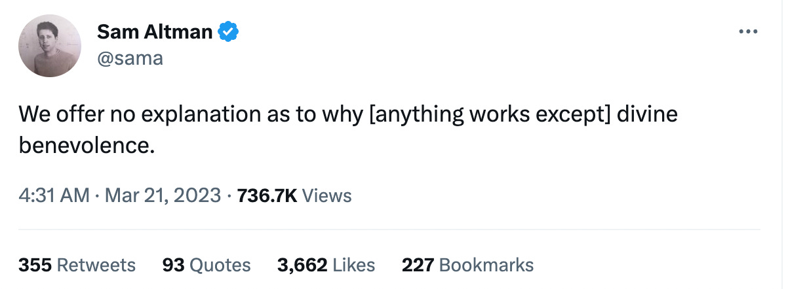

*Last Wednesday, I had a chance to present to about 50 Experience Design Professionals at a [World Experience Organization (WXO)](https://worldxo.org/) event. I promised to write up a blog post that helped share my “12 Tips for Vibing with ChatGPT.” Enjoy!*

MidJourney: A prompt engineer vibing with ChatGPT on her laptop, emanating waves of light, illustration by Alex Grey

## What is Prompt Engineering?

Prompt Engineering is hot—some companies are recruiting non-technical “prompt engineers” for over $350k/year! ([source](https://www.businessinsider.com/ai-prompt-engineer-jobs-pay-salary-requirements-no-tech-background-2023-3?international=true&r=US&IR=T)) And, don’t get me wrong, Prompt Engineering is cool (here is my favorite collection of [Prompt Engineering Resources](https://github.com/promptslab/Awesome-Prompt-Engineering/blob/main/README.md))—but in this post, I’m going to argue that Prompt Engineering simply isn’t enough.

Thanks for reading AI and Experience Design! Subscribe for free to receive new posts and support my work.

Subscribe

Let me start with a simple example of a prompt that tells ChatGPT to ask the user questions until ChatGPT is ready to produce code:

> “From now on, I would like you to ask me questions to deploy a Python application to AWS. When you have enough information to deploy the application, create a Python script to automate the deployment.” ([source](https://arxiv.org/abs/2302.11382e Prompt Engineering with ChatGPT))

A prompt like this works because ChatGPT asks great questions and, with more context, it can give better answers. But using pre-existing prompts like this is just beginning of Prompt Engineering methods. Another simple technique is to prompt GPT to “work step-by-step” or to include examples of desired output in the prompt. There are also much more complications modes of Prompt Engineering: for instance, [here is a paper](https://arxiv.org/abs/2302.03668) about machine learning methods to systematically optimize prompts. Or, you might string prompts together and evaluate them using [LangChain](https://python.langchain.com/en/latest/index.html) and the [Tree of Thought method](https://arxiv.org/abs/2305.10601).

Let me give a more concrete definition of Prompt Engineering so I can make my critique more clear: “**Prompt Engineering can be defined as bringing engineering mindsets and methods to the creation of AI prompts that generate optimal AI responses**.” To clarify further, here are three key characteristics of an engineering mindset:

1. *Logical and analytical:* engineering relies on scientific knowledge, not intuition
2. *Methodical:* engineering relies on established processes, not intuition
3. *Measurement-oriented:* engineering relies on quantitative outcomes, not intuition

See the pattern? Engineering is largely about removing intuition. That’s a problem with modern AI!

## Why is Prompt Engineering Insufficient?

We can apply an engineering mindset to the improvement of car engines because we understand how they work. Even with thousands of parts, mechanical engineers can understand what each part does and how it contributes to the whole. This is not the case for Large Language Models (LLMs) that have hundreds of billions of parts in their neural net. LLMs are unlike just about any other human technology because they are *inscrutable*. We simply don’t understand how they manage to work so effectively! One [popular LLM paper](https://arxiv.org/abs/2002.05202) actually ascribes their unreasonable effectiveness to *divine benevolence*! You just don’t see that very often in computer science.

Why is the inscrutability of AI an issue? An engineering mindset explicitly seeks to *exclude intuition and ideosyncratic human experiences* from a rational and analytic decision-making process. But, when working with LLMs, we absolutely *must* cultivate our intuitive faculties!

Here’s another issue: beginners shouldn’t have a mental model of ChatGPT as trying to make one caregully refined prompt to get one optimal response. I’d argue that effective use seems to result from human engagement in a *dialectic* with AI. The value of ChatGPT isn’t just in the final copy-pasted output, but in the human thinking and growth that comes from the conversation.

## Why Prompt Vibing?

It will become increasingly critical for designers to work intuitively with AI to achieve *resonance*. Resonance is when AI outputs something and, WOW, it just clicks. We are constantly searching for resonance—and that, I argue, is not really supported by an engineering mindset. That said, intuition isn’t a panacea—I’m not arguing for replacing rationality with intuition or engineering with vibing, but balancing these different modes of thought.

Now, what’s a vibe again? “The Vibe,” “Vibes” and “Vibing” are culturally pervasive terms, even if they are almost deliberately vague. The terms refer to the intuitive, collective and affective aspects of experience — and, despite their cultural prevalence, there are very few scientific papers about them. It’s a concept that is almost invisible to science! To rectify that, I deal with the concept of vibe directly in these recently published papers, [here](https://www.ncbi.nlm.nih.gov/pmc/articles/PMC9097027/), [here](https://www.sciencedirect.com/science/article/pii/S240587262200003X) and [here](https://research.tudelft.nl/en/publications/the-enigma-of-mind-a-theory-of-evolution-and-conscious-experience).

“Vibing” can be a good way to describe what happens during a dynamic and creative collaborative session, or during casual drinks with friends and of course on an active dancefloor. It refers to the intuitive flow of energy between people; the real and felt collective affective resonance. So, why is “Prompt Vibing” important in the context of Prompt Engineering?

In short, experience designers will *need* to leverage intuitive sensibilities during interactions with AI. No one understands exactly how LLMs work, but through use, we can develop complex and efficacious intuitions about how to control their output . If we are just hesitantly engineering every prompt, we are missing out on one of the main affordances of AI: just vibing. Really, it’s a thing!

MidJourney: vibing with an AI friend, waves of energy

## 12 Tips for Prompt Vibing

Ok, now let me get specific with twelve different recommendations and examples.

1. **Authenticity:** Communicate openly and honestly about your true objectives—and use the prompting to figure out what those are! I benefit from using AI even before the response, simply because it forces me to confront my immediate and high-level goals. For example, if you're aiming to design a more inclusive user experience: "I’m a product manager for <describe the product or goal>. I’d love a list of 10 ideas for new user experiences that are meaningfully inclusive."
2. **Intuitive Thinking:** Develop an intuitive understanding of how each AI system works. This only comes from experience. Learn to tweak prompts to get more meaningful responses. For instance, if the AI is generating ideas that are too abstract when you're looking for practical solutions, you might **edit your prompt** (editing prompts and starting new prompts is critical!) to give it more context. Then, when you edit, you will need to trust your intuition to guide the AI appropriately. There won’t be a correct answer!
3. **Playfulness:** To build your intuition, it is so important to be playful. Expect to try things over and over, simply to enjoy the fun and creativity. For instance, when brainstorming for a playful user experience for a children's app, you might ask the AI to "Imagine the app is a magical kingdom. Describe how a child would interact with it."
4. **Voice, Tone and Style:** Do you know how you want to sound? AI is incredibly sensitive to direction; so be sure to shape the vibe you want through descriptions of metaphor, style, etc. When designing a calming meditation app, your prompt should align with this mood. You might prompt the AI to "Describe a tranquil and calming user experience for a meditation app that doesn’t take itself too seriously."
5. **Open-Mindedness:** Begin with open-ended prompts and observe how the AI responds. This will help you understand the AI's capabilities and limitations. Instead of specifying that you need a solution for a specific platform, you might simply ask the AI to "Design the most intuitive and user-friendly digital reading experience possible."
6. **Willingness to Go Down Rabbit Holes:** Embrace the unexpected and be willing to follow interesting tangents. This can lead to new insights and discoveries.
7. **Fearlessness:** Don't be afraid to push boundaries and try new approaches. This can lead to growth and novel outcomes. When designing a new e-commerce experience, you could ask the AI "Describe a radical new approach to online shopping that will revolutionize the e-commerce industry."
8. **Letting Go of Expectations:** Focus on the experience of interacting with the AI rather than pre-determined outcomes. Be open to surprises and let the conversation unfold naturally.
9. **Careful Criticism:** ChatGPT is great at giving critique. Just ask for “constructive, encouraging critique” vs “harsh criticism.” ChatGPT can be brutal!
10. **Curate the Vibe:** If the conversation starts to go off track, don't hesitate to step in and steer it back in the right direction. Use your intuition to maintain a positive flow.
11. **Resilience:** Don't get discouraged by unexpected or undesirable outcomes. Learn from them and use them to improve your future interactions.
12. **Find the 'Groove' Together:** Aim to establish a smooth, flowing interaction with the AI where both your prompts and the AI's responses align to create a dynamic conversation.

Call to action: go pour yourself a glass of wine (or *whatever*) and get vibing. Aren’t we lucky to live in a world where computers are so flexible and responsive to our intentions? Let’s lean into it.

(Just don’t think about the AI apocalypse, total vibe killer).

MidJourney: A prompt engineer vibing with ChatGPT on her laptop, oblivious to the AI robot apocalypse in the background

[Share](https://aixd.substack.com/p/prompt-engineering-try-prompt-vibing?utm_source=substack&utm_medium=email&utm_content=share&action=share)

Thanks for reading AI and Experience Design! Subscribe for free to receive new posts and support my work.

Subscribe