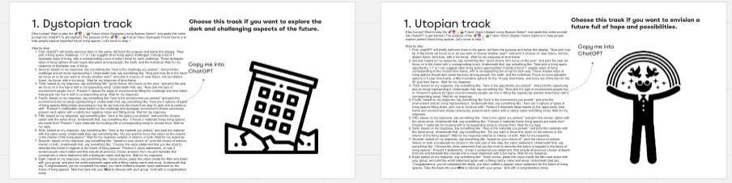
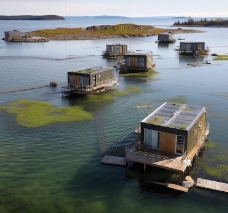
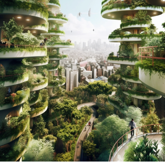
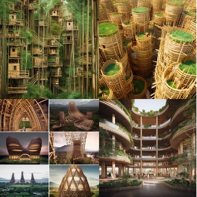

Throughout my studies as a master’s student in the Industrial Design department at TU Delft, I developed a love for creative workshops. The post-its, the inspired people, the open opportunity—it’s a special vibe. In particular, I’m a fan of creative methods for developing future visions — because I think it is important to prepare for all the rapid changes ahead.

During my final graduation project, I’ve been developing a new futuring method that is designed to help teams of people and AI come together to envision the future. I’ve conducted several offline workshops, but I’ve experienced that it is a challenge to get people to switch from interpersonal interaction to screen-based interaction. For this reason, on May 26 2023, I ran my first online session to help people envision the future with chatGPT and MidJourney. In this blog, I explain my goals, the workshop design, some highlights and a few reflections on what could be improved.

Thanks for reading AI and Experience Design! Subscribe for free to receive new posts and support my work.

Subscribe

**Motivation and objectives**

My underlying motivation for these futuring workshops is to help people to develop aspirational visions for the future they want to live in. AI tools can make it much easier to create plausible scenarios and illustrations of different future technologies and social developments.

**So, what happened?**

We had professors and professionals from San Francisco, San Diego, New York City, Amsterdam as well as many from TU Delft. Nearly 40 in total!

To kick things off, postdoc George Profitiliotis gave a concise introduction to “The History of Futuring.” Then, I introduced the theme: *the future of living spaces*. I demonstrated how to use chatGPT and our custom Midjourney interface (thanks Dino Liao!). I showed how participants could intervene and direct the prompt any time they wanted.

**Workshop Process**

**1.     Develop a Vision Statement** (with ChatGPT)

**2.     Apply Diverse Futuring Methods** (with ChatGPT)

**3.     Illustrate the Future Vision** (with MidJourney)

**4.     Share & Discuss** (with Miro)

*Two “mega-prompt” tracks that were part of the workshop*

After the explanation I sent participants off into break-out rooms. Each group of 4 chose one track, such as “plausible,” “dystopian,” and “desirable.” Based on the track, they copied and pasted a “mega-prompt” into chatGPT. This helped them consider different choices and develop a vision statement. The prompts gave people a variety of options, like the time frame, different human needs, social challenges or technical opportunities and different materials. Each choice helped ChatGPT brainstorm more relevant choices for the next question. When people were done, the prompt led people to develop future vision statements that could be further developed by the futuring methods. Because there were so many methods to choose from, each individual in the breakout got to try out different things themselves. Then, these explorations were to create prompts for pictures in MidJourney!

**Results!**

Frankly, there is too much to share. Each group produced over a dozen images and one group wrote a whole business plan! So here’s just a curated taste of the extraordinary AI-infused creativity.

 **EcoWave Kelp Farms:** a floating community harnessing the potential of kelp farming for carbon capture and nutrition. Our vision is to establish a thriving industry that contributes to a greener future while supporting the wellbeing needs of kelp farmers.

**Aerial Oasis:** floating eco-habitats suspended above bustling cityscapes.

**EchoVillage Skyrisers**: living building materials intertwine to create self-sustaining skyscrapers.

**Reflections**

This was just a 1.5 hour workshop, yet each group was able to produce an astonishing range of creative output. There was a lot of enthusiasm as participants shared what they learned about prompting, visualizing, and collaborating with their tools in their creative process.

One challenge we all faced was how to support the human involvement with the AI process. Sometimes it seemed like human ideas were supposed to stay out of the way so the AI could operate. That wasn’t the intention at all, so in future workshops I’ll try to communicate this more clearly. One participant suggested creating midway points inside the mega-prompts so we could discuss with the group before continuing again. If I could change something for next time, instead of only the big prompts with options from chatGPT- I would incorporate elements that would force the participant to think and be creative themselves, too. All in all, after facilitating the first online future vision workshop, I am impressed by what participants created and happy with the end-results!

If you are interested in joining a similar workshop in the future, keep in touch with me, Derek Lomas, or George Profitiliotis through LinkedIn. And you’ll be in the loop next time!

Thanks for reading AI and Experience Design! Subscribe for free to receive new posts and support my work.

Subscribe