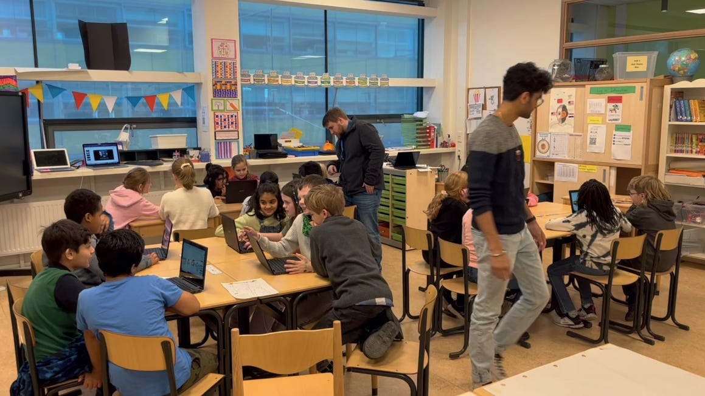
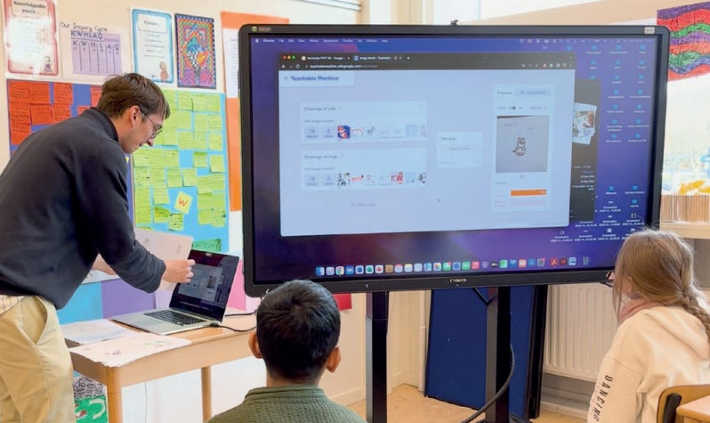

Teacher and assistant researcher walking around to assist with setting up the computers and figuring out how to use the website. Children working in pairs to stimulate peer learning

The surge in the adoption of Generative AI since 2022 has been nothing short of revolutionary. While its impact spans multiple sectors, its influence in education is both promising and challenging. Titus Visser, former student of Industrial Design at TU Delft, took an in-depth look at this by proposing a radical shift towards play-based learning in educating our future generation. Here’s what you need to know about this timely study and its implications.

## **The Problem: A Human-Centered Iterative Approach**

Employing a human-centered iterative design methodology that fuses the perspectives of children, educators, and AI experts through co-design workshops allowed the study to capture a diverse range of perceptions about Generative AI in elementary education settings.

Thanks for reading AI and Experience Design! Subscribe for free to receive new posts and support my work.

Subscribe

Titus found out that children were mainly interested in play-based interactions with AI that also foster creativity and inspiration. This eagerness for play-based AI interactions isn't just about fun and games; it could set the stage for a more interactive and exploratory form of education. However, echoing the concerns of parents, the children also expressed the need for their privacy and security to be safeguarded. Parents, like the one involved in the study, emphasized that educating children about AI isn't just about leveraging its benefits, but also about understanding its ethical and societal implications, including data harvesting by tech giants and the importance of discerning real from fake information online.

From the educators' perspective, the situation looks a bit different. Teachers emphasized the necessity for both educators and students to attain literacy in Generative AI. However, there are concerns about the practicality of integrating these technologies into existing curricula. Many educators question whether sufficient resources, including time, expertise, and infrastructure, are available to implement AI in an effective and ethically responsible manner.

Classifying self-drawn images of cats and dogs with teachable machine using webcam and a database of drawings of cats and dogs

## **Future Directions**

While imagining the future is captivating, it's crucial to recognize that the AI revolution is happening now and we should take advantage of this opportunity in education. Instead of focusing on fear of using chat GPT, students cheating, we should shift to exploring how we can use AI to our advantage to go far beyond in education and learn faster, becoming more creative. Practical solutions like workshops for teachers and parents, as well as AI-assisted programs for programming, writing skills or using AI in design, are already bridging the gap but we need more.

## Let's Engage!

We're barely scratching the surface of what's possible with AI in education. It's time to move from talk to action. Stay tuned for our next blog post diving into how AI workshops can practically enhance learning today.

Are you an educator, parent, or student with projects or questions about Generative AI in education? Let's connect and discuss more! We would love to hear your thoughts!

---

Visser, T. (2023). PLAI: Positive Implementation of Generative AI in Education through Play-Based Learning. TU Delft Repositories. http://resolver.tudelft.nl/uuid:5fa2a662-3e60-4f79-ac28-4c4a6e4aacaf

Thanks for reading AI and Experience Design! Subscribe for free to receive new posts and support my work.

Subscribe