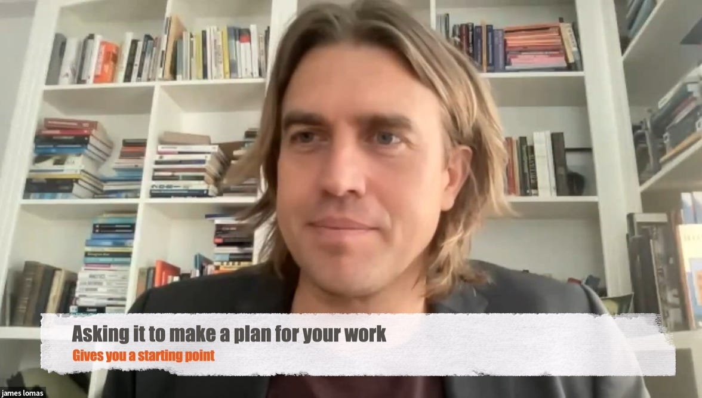

If you've been following our blog, you know that we've been advocating for the effective use of AI to advance learning and seek frontiers of AI lead education enhancing creativity. Well, it's time for an update: we've transitioned from discussing the future of AI to actively shaping it through a series of workshops teaching AI skills not only for creative and academic writing but accelerating research, fostering design thinking, and enhancing development across industries. What we're really trying to do is show that AI can be a part of everyday teaching, learning, and building for better. By equipping professionals with AI tools and knowledge, we're facilitating a leap towards more efficient and innovative solutions across industries.

## **Workshop**

Our latest workshop "Dancing with the Devil: Academic Writing in the Age of AI," led by Assistant Professor J. Derek Lomas aimed at showcasing AI's potential as a tool for advancing academia and the research sector. During the workshop, participants from diverse backgrounds, including graduate students and faculty participated in hands-on writing tasks on [Miro board](https://miro.com/app/board/uXjVNX6QO3g=/) employing AI to enhance their writing and research methods. Tools like Perplexity, Scite, hix.ai, Claude or tasks assisted by GPT prompts guiding participants in the exploration and crafting process not only speed up the research process but also enrich the quality of academic work. 

**Practical Tips for Writers Using AI:**

* **Enhance Research Efficiency:** Use AI to quickly synthesize and summarize extensive literature. Tools like Scite can help validate references, ensuring that your citations are up to date and relevant.
* **Refine Your Writing Process:** AI can assist with drafting and revising content. For instance, ChatGPT can generate outlines or suggest alternative phrasings, which you can then refine to match your voice and style.
* **Develop Strong Research Questions:** AI models can help brainstorm and refine research questions. By feeding the AI preliminary ideas, you can receive suggestions that might lead to more focused and impactful research inquiries.

For a glimpse into the creative exploration of AI applications in academic writing, check out the interactive prompts our workshop participants used. Let us know how your exploration went!

> *Let's play a game to help me get the most out of chatGPT as a masters student in industrial design engineering at TU Delft. First, welcome me with creative emoji and ask me "Would you like to explore how to best take advantage of chatGPT for your master’s education? Y/N". Wait for my response. Based on my response, say “Great, can you tell me more about your background, your current program and any ambitions for what you want to learn (or do after you graduate)?” Wait for my response. Based on my response, explain the untapped power of chatGPT (now and in the future). Then provide a numbered list of 13 detailed areas where chatGPT can help me grow and become more effective in my work and life. For each item on the list, provide meaningful emoji but not number emoji. Tell me to select the areas that would have the biggest impact on my learning and development. (selecting multiple is fine) -- or writing my own area is fine. Be sure to encourage me to use chatGPT for programming and digital prototyping, especially if I’ve never programmed before. Wait for my response. Then, based on my response, expand that area out into 10 detailed subareas and include meaningful emoji. Never say the word emoji but use it. Ask me to pick a subarea then wait for my response. Based on my response, provide 6 different suggestions or learning goals or tips explaining specifics of how to use chatGPT effectively. Be concrete, detailed and use contextual examples. Ask me to pick, then wait for my response. Then, tell me we can get started now. Ask me 1-2 questions that you’d need answered to help me (eg, can ask me about specific goals to tell me to paste in the contents of an existing document, etc etc). wait for me to respond, then get started helping me in a concrete way. Once you know enough about me, try to demonstrate how you can help me do valuable and meaningful work in an ethical manner.*

## **Direct Impact**

These workshops are the kickoff to a series of initiatives aimed at spreading integration of AI across industries. With the latest [announcement](https://openai.com/blog/introducing-gpts) of OpenAI and its GPTs you can expect to see more AI-assisted workshops and practical content coming from us soon as we are building a community where AI is recognized as a crucial collaborative partner. So is the €20/month subscription for ChatGPT Plus worth it? It supports capabilities such as DALL-E 2 for image creation and GPT-4 for language processing. This efficiency is not merely hypothetical; it is quantifiable, as evidenced by Harvard Business School's research indicating that consultants using GPT-4 were able to complete 12% more tasks, do so 25% faster, and produce work of 40% higher quality on average compared to their counterparts without AI assistance.

> **The implications of AI like GPT-4 extend across various domains:**
>
> 1. **Coding:** Automating and streamlining development processes.
> 2. **Data Analysis:** Extracting insights from complex datasets with ease.
> 3. **Image Generation:** Innovating in design with AI-driven creativity.

## **Future Directions**

We're excited about this first step and even more excited to keep you updated on what comes next. Have ideas? Questions? Want to join our next workshop? If you're as excited about this as we are, reach out to us!