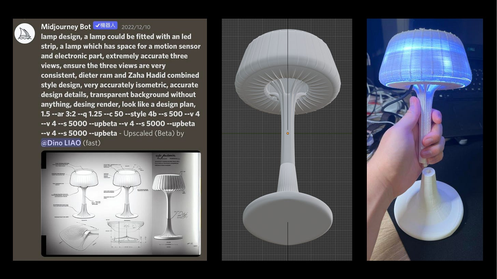
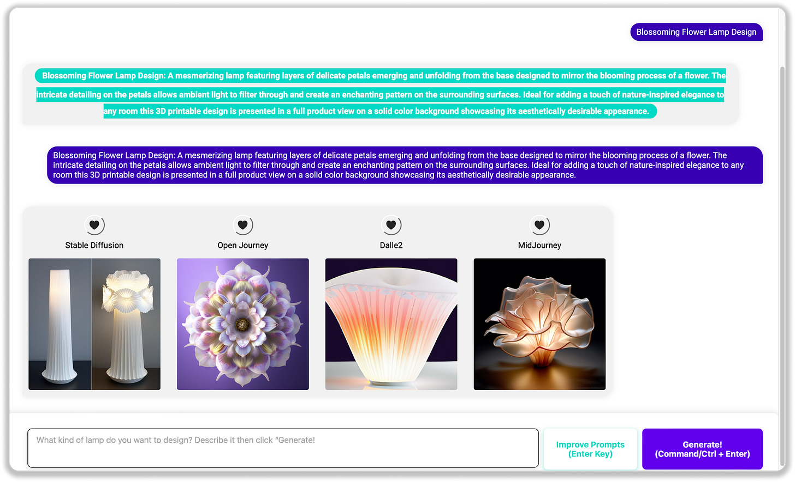
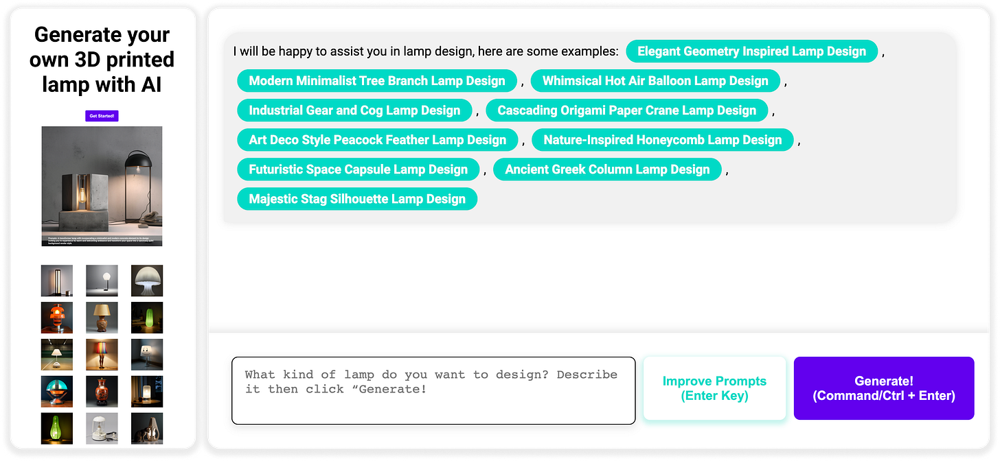
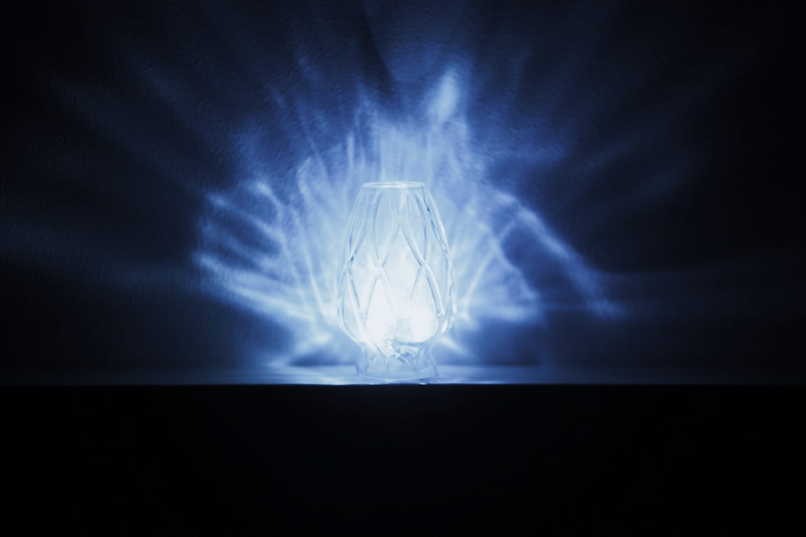
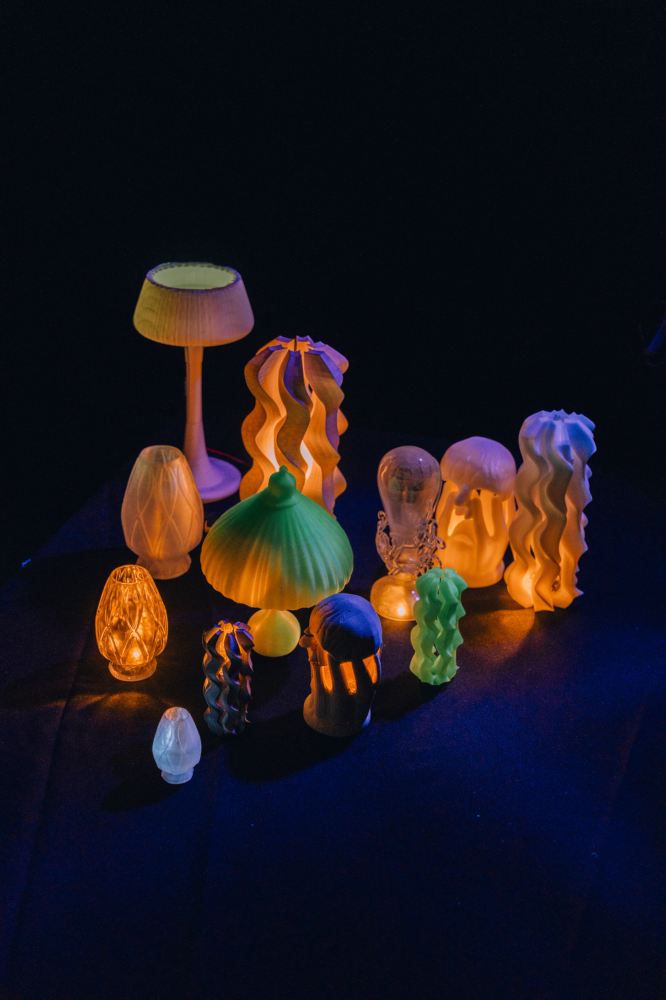
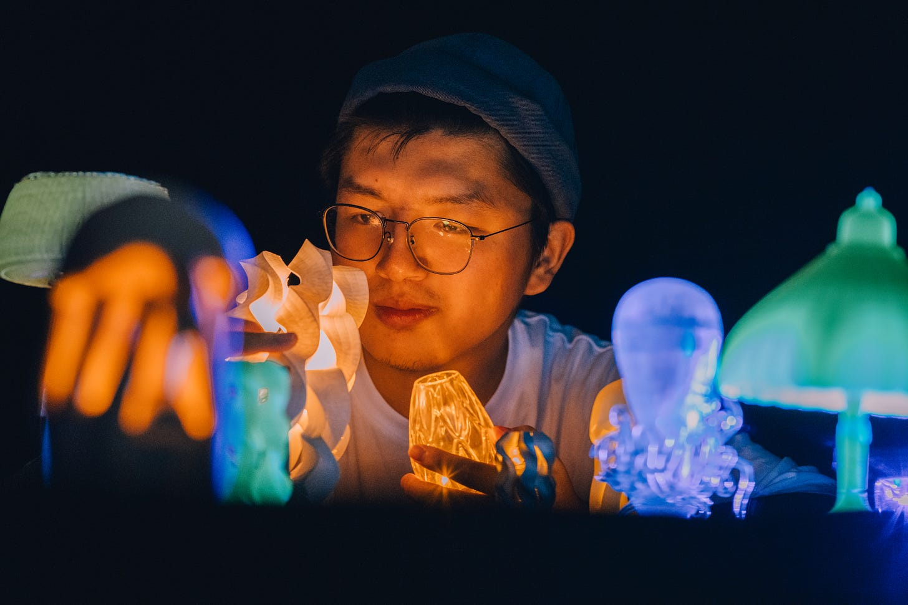

In November 2022, a conversation with Dr. Lomas sparked the inception of a groundbreaking project, just as the world was getting to know ChatGPT. The question at the forefront was: **could we really harness AI to create tangible, practical products?** Fast forward to nearly a year later, and the answer is a resounding yes, with a project that not only pushes the boundaries of design but also humorously challenges the stereotypes of AI as just a digital entity.

The project, titled "**Generative AI & Tangible Products: Human-AI Design of 3D-printed Lamps**," began as an audacious idea to merge the realms of AI and physical product design. The ambition was to create a toolkit or framework to aid designers in leveraging AI for tangible designs, particularly focusing on the realm of 3D-printed lamp designs. The idea was not only to utilize AI as a computational tool but to integrate it as a **creative partner** in the design process.

Thanks for reading AI and Experience Design! Subscribe for free to receive new posts and support my work.

Subscribe

> It was a journey that redefined the boundaries between AI and human creativity. It demonstrated how AI could be an invaluable collaborator in the design process, pushing the limits of what's possible in product design.

### **The First Steps into AI-Design Symbiosis**

My initial journey in December 2022 involved experimenting with Midjourney, an AI tool, to generate numerous lamp designs. It was like unearthing hidden treasures, each design offering a unique glimpse into the possibilities of AI-assisted creativity. The chosen design, after some digital refinement, was handed over to Kaedim, an AI capable of transforming 2D images into 3D models. The result? A surprisingly adept 3D lamp model, tweaked to accommodate lighting electronics and ready for 3D printing. This marked the birth of the first-ever lamp designed with AI assistance (or so I like to believe 😃).

Image 1: Process of designing the lamp starting from prompt to end product.

### **Expanding the Horizon: AI as a Design Collaborator**

The project's methodology was enriched by incorporating sophisticated generative AI tools like Stable Diffusion, Midjourney, and DALL-E 2, known for their ability to convert text prompts into visual images. These AI tools opened new doors in the creative process, providing fresh perspectives and unique design inspiration.

The project was anchored in three main inquiries:

1. **User Interface Development and AI Implementation**

   The initial phase of the project focused on developing a user interface (UI) that facilitated AI-assisted design. This involved using early AI models to gather user interaction and designer input, which was pivotal in refining these models and ensuring an intuitive, collaborative process. The UI development was iterative, heavily relying on user feedback to shape its design, with the goal of creating a user-friendly interface that effectively integrated AI into the design process. As the project progressed, it became evident that incorporating a broader range of AI generative models like DALL-E 2 would enhance the diversity and quality of images, thus broadening creative possibilities for designers. This stage saw designers actively generating lamp designs using these AI models, significantly contributing to the project's creative output. The project also emphasized a user-centred design approach, where feedback was meticulously evaluated to inform design revisions. This comprehensive process included a detailed analysis of the selected AI models, ensuring their effective integration into the design process and enhancing the overall design experience. The culmination of this effort is reflected in the final outcome of the user interface, set up on [dinuoliao.com](http://dinuoliao.com/) (currently not functionally operational, but still viewable).

   

   Image 2: User Interface Design.

   

   Image 3: Process of collaborating with AI.
2. **Bringing Designs to Life: The 3D Printing Implementation**

   Our project extensively employed 3D printing to bring AI-assisted designs to life. The primary method used was Fused Deposition Modeling (FDM), a reliable and versatile technique ideal for experimenting with various materials. We used standard Polylactic Acid (PLA), fluorescent PLA for glow-in-the-dark effects, and PETG for its durability and clarity, crucial for more intricate lamp designs. Each material brought unique aesthetic and functional properties to the lamps, enhancing their appeal and usability. Additionally, Stereolithography (SLA) printing was instrumental for lamps requiring high precision and smooth finishes, particularly effective for transparent designs. These varied 3D printing methods allowed us to explore a wide spectrum of design possibilities, from functional everyday lamps to decorative, aesthetically-driven pieces.

   

   Image 4: 3D printed product.

   

   Image 5: Final products of the project.

   

   Image 6: Dinuo with designed lamps.
3. **Research Insights and Design Innovations**

   In the project, two key research studies were conducted to enhance AI-assisted design. The first utilized a custom GPT-4 model for optimizing design prompts, significantly improving the desirability and alignment of AI-generated lamp designs, though with mixed results in printability. The second study applied the LoRA model to fine-tune Stable Diffusion based on human preference data, resulting in a substantial enhancement of the aesthetic appeal and desirability of designs. These studies collectively demonstrated the potential of AI models to refine the creative design process, aligning AI-generated outputs more closely with human aesthetic preferences. I will elaborate on this part in the next post 😃!

### **Future Aspirations**

Looking back, this project was not just about creating lamps. **It was a journey that redefined the boundaries between AI and human creativity. It demonstrated how AI could be an invaluable collaborator in the design process, pushing the limits of what's possible in product design.** At the end of Nov 2023, there were many new tools that could even better contribute to this project, such as [Meshy.ai](http://meshy.ai/) and [csm.ai](http://csm.ai/), new tools that can transfer 2D images into 3D models, providing a more promising future for AI-assisted modelling. Stable Diffusion XL and DALL-E 3 offer improved tools to inspire people and create design concepts. With GPTs, if I were doing the project this year, I wouldn't need to develop the user interface on my own but could build a GPT agent with all the functions we have in the user interface web design.

The "Generative AI & Tangible Products" project marks a significant milestone in the field of design. It showcases the transformative impact of AI in creating tangible products that blend functionality with aesthetic appeal. As we move forward, this project serves as a beacon, guiding us toward a future where AI and human creativity coalesce to create not just products, but experiences that enrich human lives. **Designers should consider how to use AI tools in a way that benefits us in design works, embracing a future where AI will get more and more involved in our daily lives.**

Do you have similar ideas or projects that you are working on? Or perhaps you would like to join our AI and Experience Design research group's open weekly meetings on Zoom? **Let’s connect!**

---

Liao, D. (2023). Generative AI &amp; Tangible Products: Human-AI Design of 3D-printed Lamps. https://repository.tudelft.nl/islandora/object/uuid:083276b5-1580-482c-a36b-94576e15c2c2?collection=education

---

Thanks for reading AI and Experience Design! Subscribe for free to receive new posts and support my work.

Subscribe