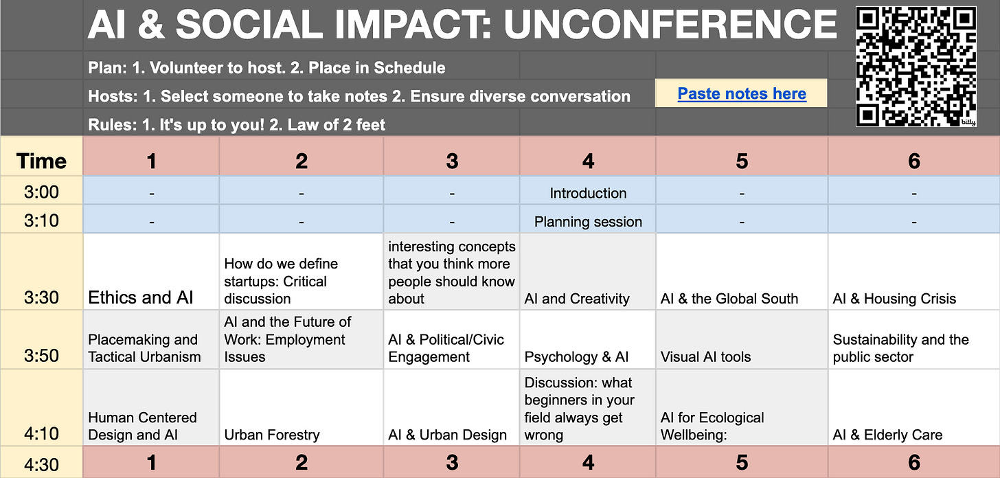
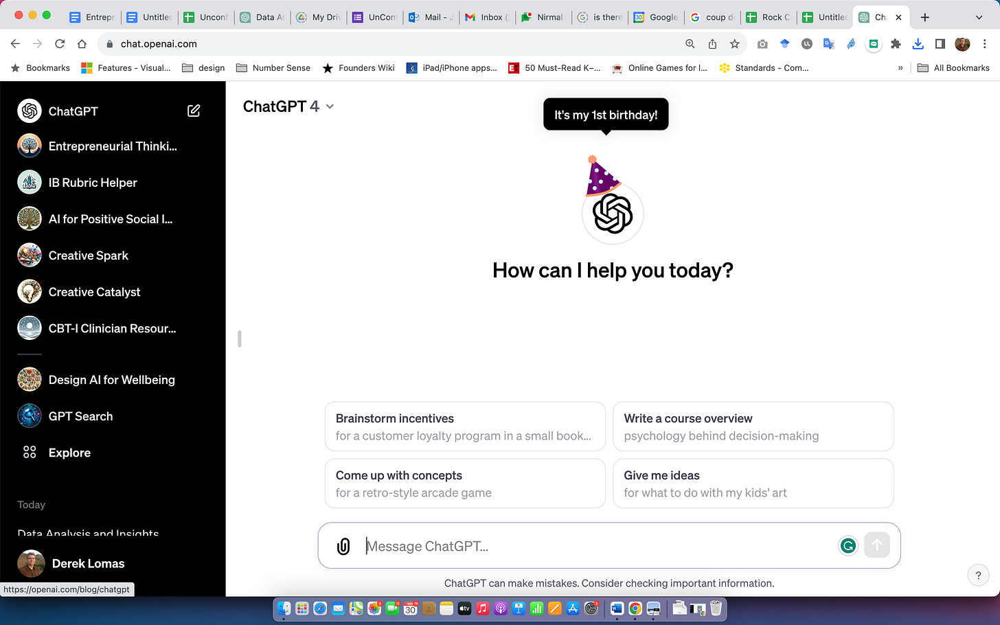

Two days ago, I hosted nearly 70 people at the [AMS Institute](https://www.ams-institute.org/) in Amsterdam for an UNCONFERENCE about **AI, Entrepreneurship and Social Impact**. The theme pointed to the power of AI in the hands of social entrepreneurs—how might generative AI help generate positive social change?

Normal conferences involve politely sitting down and watching a prepared slide presentation from an expert. At an unconference, on the other hand, each session is better thought of as a conversation. Not that we didn’t have experts! For instance, here’s a snap of Ling-Po Shih, a strategic data scientist for the city of Utrecht, as he discusses his current work using AI to address the housing crisis in the Netherlands.

Thanks for reading AI and Experience Design! Subscribe for free to receive new posts and support my work.

Subscribe

In total, our unconference hosted 36 different sessions across 6 parallel tracks. Below, I’ve shared a picture of the spreadsheet we used to plan the unconference—the schedule was fixed during the first 20 minutes of the event! It sounds wild, but the format really works. In the days leading up to the conference, participants suggested topics and voted. Then, during the planning session, we specified time for individual sessions and participants volunteered to host. By the time the unconference ended around 6 pm, everyone was buzzing. It wasn’t just the beer, I swear—it was that feeling you get when you talk about your favorite topics! All participants got to determine the agenda and attend whichever session they wanted. Unconferences rely on the “law of two feet”: meaning, if you don’t like the current conversation, get up and find one that you like!

This unconference was prepared in the context of a course I teach (“Entrepreneurial Thinking”) at the AMS Institute in Amsterdam. The students are in a master’s program focusing on urban design issues ([the MADE program](https://www.ams-institute.org/education/msc-metropolitan-analysis-design-and-engineering/msc-made-program/)). Last year was my first year incorporating Large Language Models into the course, using a GPT3 prototype we’d built called AIWritingHelper.com. For the first time, it was possible to draft a clear business plan around a half-baked idea at the push of a button. But, apart from a short workshop teaching students how to use AI for brainstorming, there wasn’t much AI involvement. ChatGPT hadn’t yet been born, after all. BTW: happy birthday, ChatGPT! I can’t believe you turned one year old yesterday :)

This year, I devided to revise the whole course. ChatGPT, particularly GPT4, makes a major difference in the ability of a student to think through key aspects of starting a business or nonprofit. To be perfectly honest, the students weren’t exactly thrilled—I asked them about their interest in AI at the beginning of the course and you can loudly hear the “meh.”

[. Number of responses: 53 responses.")](https://substackcdn.com/image/fetch/$s_!nTzr!,f_auto,q_auto:good,fl_progressive:steep/https%3A%2F%2Fsubstack-post-media.s3.amazonaws.com%2Fpublic%2Fimages%2Fbdf43e55-6f9a-44a3-9a5e-fb0ae2e13fac_2196x1044.png)

However, students *are* excited to create world-changing impact across a variety of social issues. For instance, here is a session that was focused on the potential impact of AI on the so-called Global South.

It was really appreciated having so many thought leaders attend this event, from the social designers at [Ink Studio](https://www.ink.team/wat-we-doen), to regenerative design specialist [Thieu Besselink](https://www.linkedin.com/in/thieu/?originalSubdomain=nl), to local organizations like [Clean Up Your City](https://www.instagram.com/cleanupyourcity/) — special thanks to all participants for contributing to a magical event!

Thanks for reading AI and Experience Design! Subscribe for free to receive new posts and support my work.

Subscribe