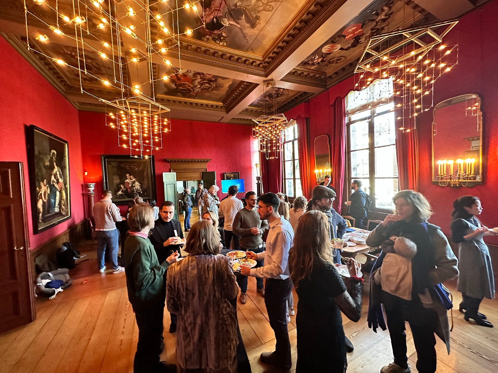
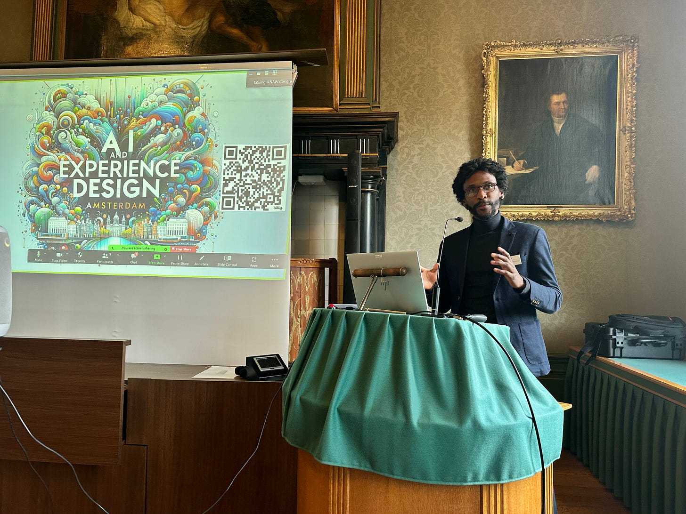
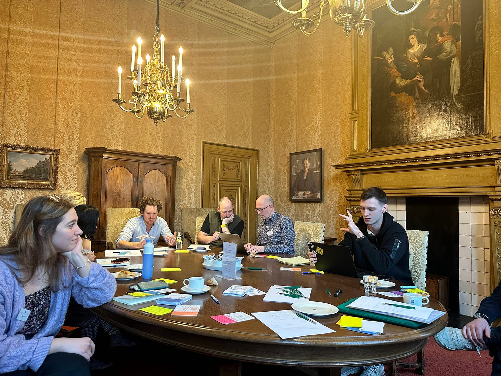
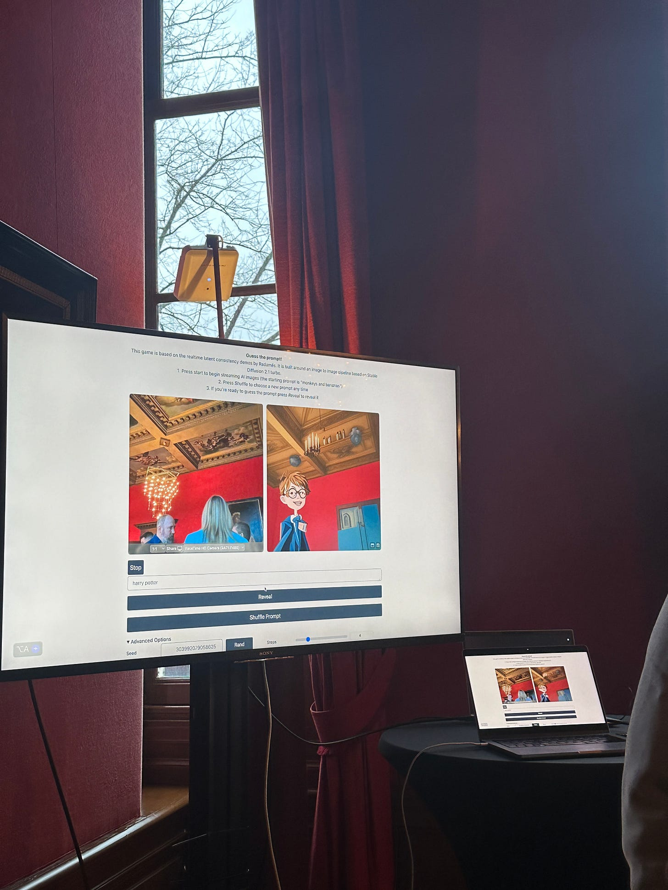
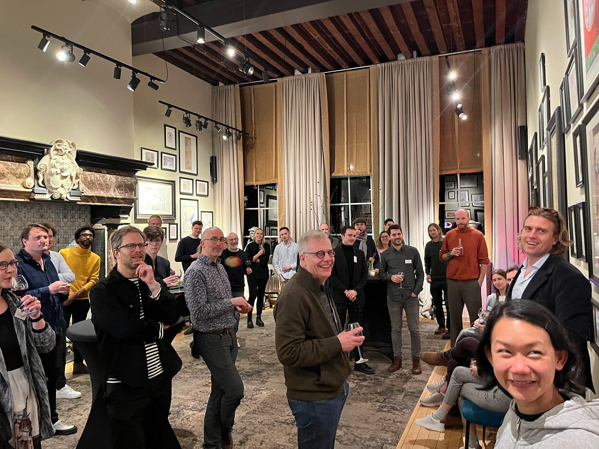

Only last week, Amsterdam’s historic Trippenhuis played host to almost 60 people for an AI & Experience Design Conference, which was a melting pot of the most creative minds in AI, art, design, and technology. At the beginning of 2024, this became an invitation to reflect on the jaw-dropping developments in generative AI this past year and to consider how it might impact design. How can Generative AI be used to design meaningful experiences?

Networking during breaks at Trippenhuis

This wasn’t your typical conference; it was a hub of dynamic discussions and great ideas about the future of AI in the creative industries. It’s exactly what we aimed for: creating a space for a diverse group of designers to come together to share emerging creative practices and insights.

The unique thing about this event was the enthusiasm that people had for it. They did more than merely listen; instead, they actively took part, questioned, and shaped the events through their knowledge and inquisitiveness. It was an all-inclusive session where everybody could speak up and share ideas and initiatives. We started with amazing demonstrations on AI before moving to provoking presentations followed by workshops that dwelt on topics ranging from emotional design as well as AI in UI/UX to its implications upon education, architecture, film, among others.

Jairo da Costa Junior; assistant professor of Systems Thinking at UT; Futuring Session

Among other speakers that you will soon know more about from our upcoming series of posts, were Katy Barnard, UX Design Researcher, Dan Porder, Content Designer at IKEA, and Ferkan Metin, Product Owner at Envision. Katy led us through her qualitative research, highlighting how AI, specifically ChatGPT, can give us insights on user behaviors as they enable designers to understand people’s motivations leading to more empathetic and user-centered designs. Dan, on the other hand, shared Ikea's perspective, emphasizing the critical role of data integrity and the strategic application of AI in content creation and brand storytelling, ensuring that AI-generated content can be effectively used in brand storytelling or content creation so that it promotes the brand without compromising its values or narrative.

Ferkan showed a new device from Envision designed to articulate visual information into speech for those with visual impairments. His talk demonstrated the importance of AI and its profound impact in creating assistive technologies that offer a richer description of the environment, enhancing the autonomy and experience of visually impaired users.

Brainstorming session

Afterwards, the workshops provided a hands-on exploration of these themes, offering a space to explore and engage directly with AI tools in design. Through the collaborative exercises, attendees brainstormed new ideas, solutions, and applications of technologies across industries.

At the end of the conference, it became clear that this was only the first step in a very exciting journey of a community shaping the next waves of AI in Design. AI intersecting with design is not all about technology; rather, it is about rethinking creativity’s boundaries and stepping into new directions of experiencing and interacting with our environment. This conference gave us a sneak peek into a future where AI does not just support designing but actively collaborates on the creative process, opening doors for endless possibilities yet remodeling our understanding of art and design in digital times.

Application of AI in real time

For anyone who missed out, you left an empty space that was suffused with inspiration and imagination. But don’t worry, since these ripples will be felt far off as we keep on moving with next ideas, projects, and initiatives, one of them coming mid-March online where all of you are invited. As an AI community that is not just focused on big tech or regulating, we are exploring and pushing AI beyond its current boundaries applied in experience designs. Feel free to reach out if you would like to be part of this community! If you are curious to see more details - please find the pictures [here](https://drive.google.com/drive/folders/1hxxtLdDdrfLSIKthW6eHsiWnb17KppQf?usp=drive_link)

Afterpart at the Embassy of Free Mind!