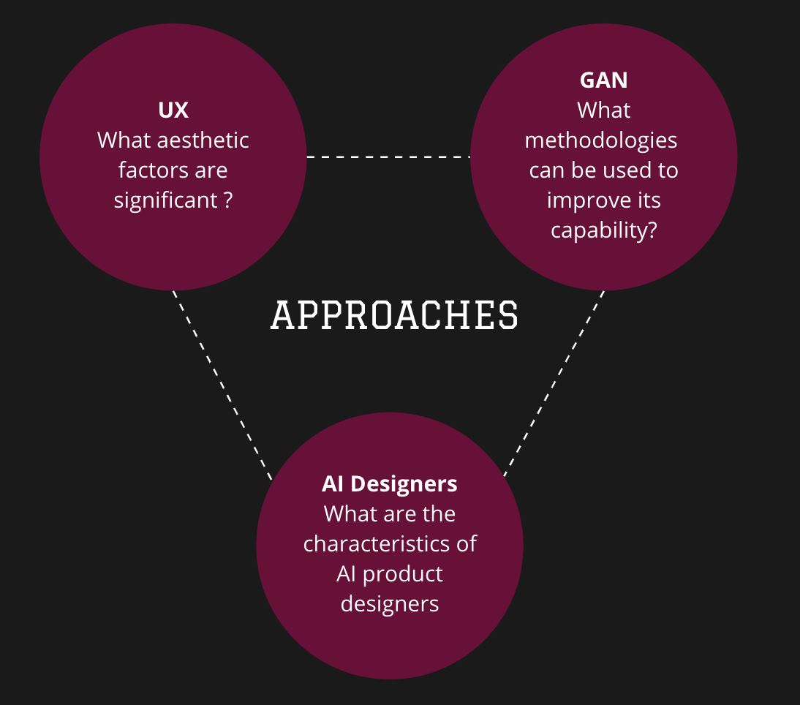
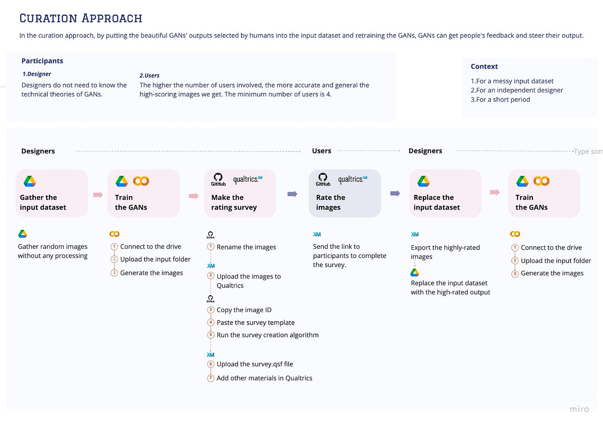
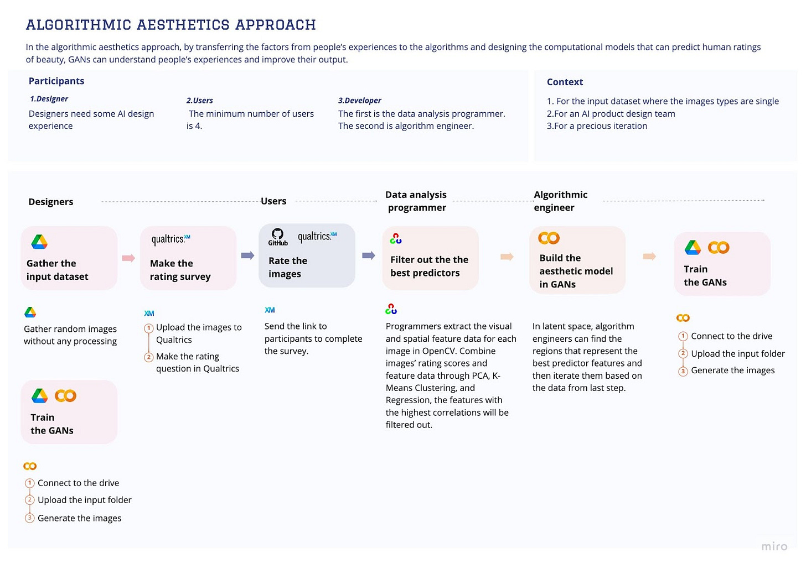

As we saw a few weeks ago during [AIXD 2024](https://aixd.substack.com/p/ai-and-experience-design-conference), Artificial Intelligence has brought lots of changes to the human world. However, many aspects of human experience, like aesthetic beauty, are not directly accessible to AI systems. The inability of AI to use the human experience hinder its capabilities to improve as well as impact human experience design.Meanwhile, as more designers dive into the AI field, AI product designers play more crucial roles in shaping AI systems. Are there any opportunities for them to become a translator between the qualitative human world and the quantitative AI world? Shuyue Jin explored this question in her Master thesis project at TU Delft!

“I focus on the GANs (Generative Adversarial Networks), an AI system that can generate fake output for human society, sets the target users as designers working in the AI field, and identifies elements that affect aesthetic beauty (Figure 1). I investigate how to enable designers to efficiently inform GANs of people's feedback and then steer their output. Through the final approaches, designers can translate the qualitative factors from human experience to the quantitative AI systems and enable AI systems to understand human experience.

*Figure 1. The Scope of the project*

I originate from LANDSHAPES, designed by Frederik Ueberschär. It is an interactive exhibition piece. Its contents are AI-generated aerial landscapes generated by GANs. It proves its potential influence on people’s experiences and the designer's important role in AI products.

Desk research and practical operations in GANs show that GANs have the potential ability to “understand” human experience according to their plenty of parameters like latent space and discriminator. The qualitative research on the human experience of GANs’ output revealed the different factors influencing aesthetics. Some factors are abstract (such as the memory evoked by images), while other factors (such as contrast and saturation) have the potential to be quantified. Also, the research about the target user - AI product designers are conducted to make the final methods more practical.

Based on those insights from three fields, two hypotheses, including retraining with the highly-rated images and building new computational models to iterate the factors, are put forward to inform the AI system of human experience.

Finally, two approaches were built. The first one is the CURATION APPROACH -  Putting the beautiful GANs’ outputs selected by people into the input dataset and retraining the GANs.

The curation approach is a method that can be useful for any kind of input dataset regardless of its content and information. Guided by which, designers can iterate the GANs' output quickly and conveniently. Without the technical theories of GANs, designers can still become good translators to inform AI systems' human experience accurately.

> **In the curation approach, by putting the beautiful GANs' outputs selected by humans into the input dataset and retraining the GANs, GANs can get people's feedback and steer their output.**

In this process, GANs obtain the human experience in the form of "good output" selected by humans as their inspiration, and the designer "translates" the human experience through the action of "using excellent output as input and retraining the GANs."

From the perspective of the input image, this method informs the AI ​​system of people's evaluation through retraining GANs using good output.

*Figure 2. Curation approach*

The second is the “ALGORITHMIC AESTHETICS APPROACH” - transferring the factors from people’s experiences to the algorithms and designing the computational models that can predict human ratings of beauty. The evaluation results show their validity in informing AI systems about the human experience.

The algorithmic aesthetics approach is a method to improve the quality of GANs’ output from quantitative iteration, and it complements qualitative research and computational analysis. The algorithmic aesthetics approach can provide designers with a more nuanced and precise method to inform AI systems human experience. Guided by the algorithmic aesthetics approach, designers can iterate the GANs’ output in more detail.

> **In the algorithmic aesthetics approach, by transferring the factors from people’s experiences to the algorithms and designing the computational models that can predict human ratings of beauty, GANs can understand people’s experiences and improve their output.**

In this process, the system obtains the human experience in the form of “good factors”, which can be predicted by aesthetic models in GANs. Moreover, the designer "translates" the human experience through the action of "finding the factors that influence people’s rating and also can be measured by automated measures in algorithms."

*Figure 3.* Algorithmic Aesthetic Approach

How can AI product designers like us transcend the traditional limits of technology to build AI systems that not only comprehend, but also enrich our human experiences Shuyue Jin's project should make us think about this major point and allow us to catch a glimpse of a future where AI acts as a bridge between quantifiable and qualitative, between algorithmic precision and human aesthetics. Are we prepared to mentor AI in becoming an expert in matters involving humanity, fusing our preferences, recollections as well as sentiments into it? This is not just around the future of design; it is about the future of how we engage with the world.

> Jin, S. (2022). *How might human experience inform AI systems*. TU Delft Repositories. https://repository.tudelft.nl/islandora/object/uuid%3Ae506d582-820b-4356-8b43-6513cc070b7a