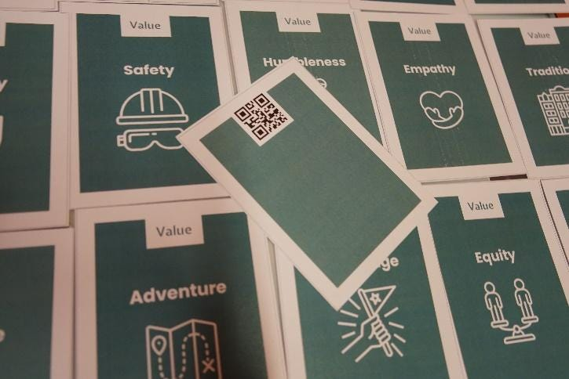
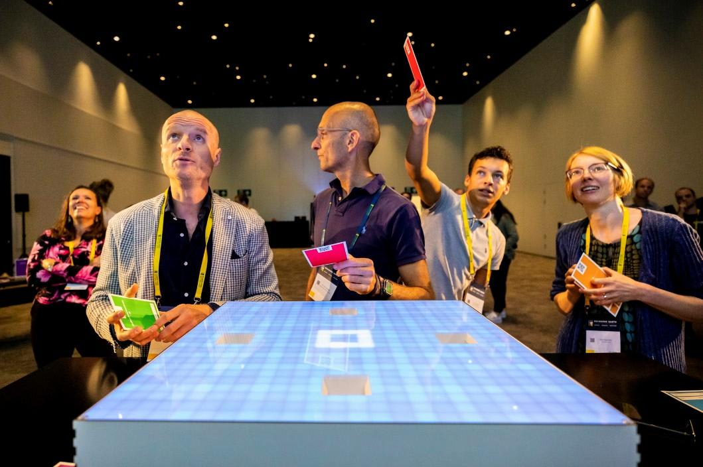
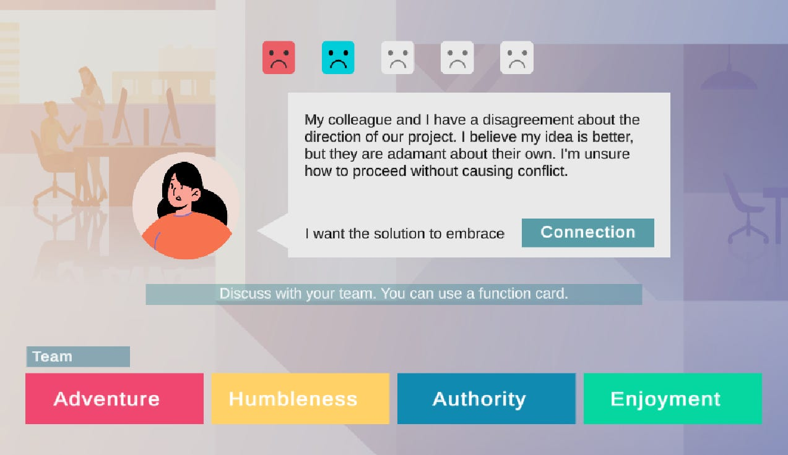
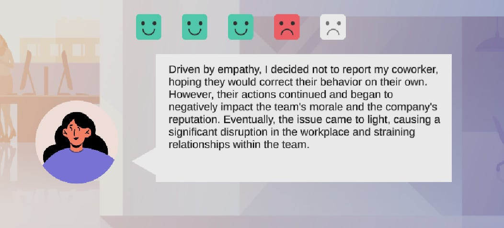
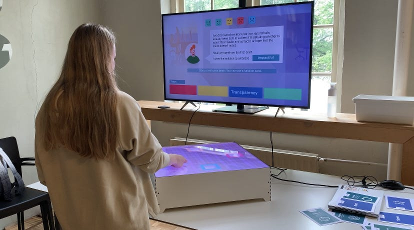

In an era where Artificial Intelligence (AI) reshapes every facet of our lives, how can it also deepen our connection to something as intangible as our own values? This Master thesis of Xin Wen ventures into uncharted territory, where AI isn't just a marvel of technology but a bridge to our humanity. Can it really help us connect more deeply with ourselves?

“My Master thesis is dedicated to creating a game that utilizes ChatGPT and the Sciffle Box to assist players in discussing and understanding corporate values aligned with their personal human values. The integration of ChatGPT and the Sciffle Box is designed to render the exploration of abstract human values more accessible and engaging, fostering a deeper connection between employees and their corporate values through a playful and immersive game design.

### **Wait, what is the Sciffle Box?**

The Sciffle Box is a product developed by Ijsfontein. It comes with an LED metric and four scanners that scan QR codes per second. By connecting the box to a monitor, players can interact with digital games using physical cards (that have QR codes on the back). This interaction became the foundation of our game with ChatGPT. The Sciffle Box is primarily used in a corporate training context, focusing on social interactions and enabling players to work together and have meaningful conversations.

Cards with QR codes on the back

Scanning cards on the Sciffle Box

### **How did values and corporate training become relevant?**

Here is a direct answer: Because values are so ambiguous, abstract, and hard to communicate, we need to establish deeper connections to make corporate training more effective.

Values serve as the guiding principles for humans. In different contexts, various values are prioritized to assist us in taking action or making decisions. But at the same time, they are usually in a very abstract form. Think about values like Equality or Sustainability. You might not have a quick answer on what exactly they mean to you. We can easily agree that we both share the value of sustainability but for me, it can mean recycling plastic, while for others, it could mean being vegan. This discrepancy leads to significant challenges in aligning values or even understanding what we are aligned with in the first place.

At the same time, in corporate value training, we try to communicate who we are as a company but forget to start with who our employees are and what are their personal values. If corporate values can be integrated with their personal values, employees are more likely to use those values in their daily work, leading to better team collaboration, smoother communication, and greater efficiency.

Corporate training session with ABN AMRO

### **Ok, that makes sense, but why is AI here?**

AI technology is becoming increasingly important in our work and daily life; people start asking, “Oh, ChatGPT is down, how do I work now?”.

With the Sciffle Box, we are able to explore a different way of using AI chatbox technology. Instead of the traditional way of typing to AI and getting responses on a screen, we explore the possibility of using it in a social context. This way, AI becomes the facilitator, helping us have meaningful conversations, providing different opinions, and empowering us to think about different understandings of values. Instead of focusing on talking to AI, we focus on talking to each other, having deeper value connections with other people in a sociable and tangible setup. This is a new role of AI that we have not explored before.

### **So, what does the game look like?**

Players are divided into four groups, each group containing 2-5 players with their own unique deck of 5 value cards. ChatGPT will generate a list of five working dilemmas based on the company players are working at. These dilemmas will be presented on the screen with a corporate value, and players have to discuss them within their group and pick a value card that they think will solve the dilemma but also fit the corporate value. Each value card can only be used once; this encourages players to challenge themselves and step out of their comfort zone to explore the diversity of values and be more open to new understandings of values.

The game setup

After each team scans their value, they will explain why they think that value is important and what the corporate value means to them. Then, each team can vote for the value that they think is the best solution, and the value that receives the most votes will be sent to ChatGPT. ChatGPT will generate a narrative based on the dilemma and selected value. These narratives can be positive, negative, or neutral, giving players a more playful experience and a deeper understanding of the diversity of values.

Game UI: dilemmas with four teams scanned their selected value

Example feedback: negative narrative

During the game experience, players are able to actively link their own values to corporate values, have specific contexts to explain their understanding of values, and have an open environment to share and connect with other people's values. With the help of cards, players could explore different values that might not be their first option, making comparisons on which one is more important for them, and being inspired by different solutions in a working context.

> *“I really like the fact that you think about it some values, that, you know, we don’t really think about. …I thought it was really nice that you, think about empathy e.g. In what way empathy can do in this specific situation, I think it helps you to organize your thoughts by creating a story, connecting the words (and expressing the value)” (Participant 4)*”

> “*Usually, you can only think about one solution (with the value cards you can think about more). So for me, I learned it’s, you have a lot of choices.” (Participant 6)*”

Participants interacting with the user interface

### **Challenge 1: How to scope values to a handful of cards?**

Human Values Website

There are endless words that can represent human values. In the game, I wanted to include some examples of values on cards to guide people in having meaningful conversations, but I was soon overwhelmed by the vast number of values available for discussion. Fortunately, I did not need all the values in the world. By adopting the Schwartz value theory (Schwartz, S. H. (2012)), human values are divided into 10 different categories. I selected two representative values in each category and assembled a card deck containing 20 values, which can be diverse enough for players to choose from but also easy to process. Having a value framework helped me scale it down and have a good starting point.

Schwartz value theory

### Challenge 2: How to unpack values and corporate values in the game?

One of the most challenging aspects is helping people have meaningful conversations about values. As mentioned before, values can be very vague, and people often struggle to articulate their thoughts about them. It appears crucial to help players unpack the complexity of values so they can communicate them with greater accuracy and achieve a deeper understanding.

To solve this challenge, different dilemmas in the working environment were created to help players link values with actions, using values as lenses to analyze problems and provide solutions. These dilemmas are crafted to be related to players’ daily work. They are relatable and familiar, which triggers players to first think about what they would do in this context, and then figure out which value is linked to their action. At the same time, a deck of five value cards is provided to each team, offering examples to link their actions with. Players can compare different values and choose the one they think will be the best solution, making values much easier to process. This strong bridge between value cards and actions brings values down to a more definite level, enabling value connection to touch the core of each player.

> ***Example dilemmas in a design agency:***
>
> ***Dilemma 1:** I'm working on a project that requires collaboration with a team from another department. However, their communication style is very different from mine, and I find it challenging to understand their expectations and provide the necessary input.*
>
> ***Dilemma 2:** My workload has increased significantly, and I'm struggling to meet all the deadlines. I have the option to ask for help, but doing so might be perceived as a sign of weakness or an inability to handle my responsibilities.*
>
> ***Dilemma 3:** There is a conflict between two colleagues in my team. They have different opinions on how to approach a project, and their disagreement is affecting the overall team dynamics and productivity.*

Now we already have a good understanding of our own values in different working contexts, so it is the time to understand corporate values and discover what they mean to us. For each dilemma, a corporate value is attached as the goal of your solution. In this way, players not only have to pick a value card to solve the dilemma that is good for them but also to make the solution fit the corporate value.  This enabled conversations about what each corporate value means to you in this working context, and how can we behave according to it. It enables employees to discuss corporate values in a working environment that will bring impact not only in the game but also in the real working environment.

Impactful is the corporate value, acting as the goal of solution in this dilemma

### Challenge 3: How to work with ChatGPT in a value game**?**

In the final prototype, ChatGPT is connected with Unity, where I create a ChatGPT live conversation when the game starts and send the scanned values to ChatGPT from Unity, then get the feedback on the screen. In this way, Unity and ChatGPT are running in parallel, enabling real-time interaction with the AI chatbox for each game.

This solution brings opportunities but also challenges. First, when one part of the conversation goes wrong, it might impact the entire game. Therefore, the prompt I send at the start of the game needs to be very accurate and guide ChatGPT throughout the entire journey.

> *“Let’s play a game. The game aims to help people learn how diverse values are and how different values solve problems in a working environment. First, based on the company ijsfontein you generate a list of 10 possible dilemmas written in a first-person perspective. You need to first give me all the 10 dilemmas in full text with narrative details in the form of Number + Dilemma+:. Don’t start without giving me the full list! Then ask me shall we start from the first one? Wait for my answer. Based on my answer, give me the dilemma then ask me ”What value shall I use to solve this problem, positive negative or middle?”, and wait for my reply. If I say positive, give me a good result, negative will be a very bad result. The middle is a mediocre result. Based on my answer, you need to reply to only a story within 50 words without saying any other words. Share what happens in a first-person perspective when that value is applied without mentioning the words positive, negative, or middle. Then ask me "Do you want to go to the next dilemma? Y/N" "*

In this prompt, I set up many checkpoints to ensure Unity and ChatGPT are on the same timeline. At the same time, I defined a very specific structure for ChatGPT to generate, so I can present to players only the text that is relevant to them in the game. ChatGPT is very dynamic; it will provide different answers to each game. My prompt was able to control the answers so even if they are different, they will still land in a safe range where the texts support the gameplay and meaningful value conversation. However, ChatGPT is a conversational chatbox; it will answer questions with an end like: "Shall we start?" or "Shall we go to the next one?" This could drag players out of the game context that I set up for them and break the fourth wall. In the end, I set up a parser in Unity to parse out all the words that are not relevant to the game, to make sure all the text in the game supports the play.

If we can name one thing that ChatGPT is bad at, it is being negative. In the game, there will be different feedback after players select the value they think is the best solution; the feedback can be positive, middle, or negative. This can help players understand the diversity of values, that they might not be good all the time, and bring more gaming elements into the play. However, during the process of testing, it was found that ChatGPT always gives positive answers, even when the value is laziness or rudeness; it will still generate a story about how that helped with work. To ensure it delivers the right gameplay experience, I had to manually control the outcome. During the game session, there will be a facilitator who guides the players through the game together with ChatGPT. After players select their answer, the facilitator will scan the card: positive, middle, or negative based on how the players are reacting to the game. This not only ensures the game runs as designed but also ensures the game is flexible enough that the facilitator can read the room and ensure players are having a fun and meaningful session.

### Thoughts for the Futur**e**

In the end, I was able to successfully unpack the complexity of human values by providing value cards and specific context. At the same time, the adaptation of ChatGPT brought insight into how AI chatbox technology can support human conversations in a tangible and sociable way. I discovered different tips on how to work with ChatGPT to ensure it delivers meaningful context to support the experience as designed. Of course, the interaction model still needs more development; for example, after Unity sends each message to ChatGPT, players have to wait a long time for ChatGPT to respond and for Unity to process the information on the display. However, this interaction model connecting human face-to-face interaction with AI chatbox can be further explored in different contexts to bring richer insights.”

Are you interested in exploratory AI research and design? Follow and subscribe!

Schwartz, S. H. (2012). An Overview of the Schwartz Theory of Basic Values. Online Readings in Psychology and Culture, 2 (1) https://doi.org/10.9707/2307-0919.1116